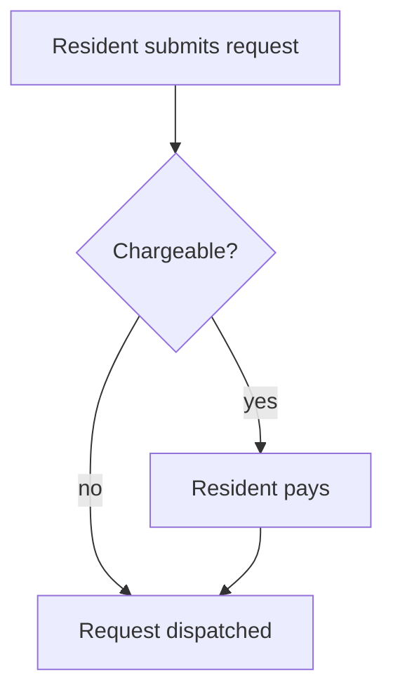

# Mermaid Diagrams (default) — with Miro on demand

All BRD diagrams are authored as **inline Mermaid** by default. Every diagram is followed by a 1-2 sentence prose **Summary** so a reader without a Mermaid renderer still understands what it says. Miro boards are produced **only when the user explicitly asks** — see § Miro on demand.

## Why Mermaid-first

1. The BRD lives in git next to the SDD and LLD; inline diagrams version, diff, and review with the text.
2. Downstream skills (`sdd-unifier`, reviewers) read the BRD directly — an inline diagram is machine-readable; a board link is not.
3. No external dependency: the document is complete offline, with no MCP or board access required.

## Business language only

BRD diagrams follow the same rule as BRD text: **no technical terminology**. Nodes and edges are named after personas, business concepts, and business actions ("Resident submits request", "Finance approves refund") — never components, services, protocols, or datastores. If a source diagram is technical, park the technical content in Appendix § Technical Inputs for the SDD and redraw the business view.

---

## Diagram-type → dialect map

| Template section | Diagram | Mermaid dialect |
|---|---|---|
| Executive Summary (optional, if context helps) | Simple context sketch — the product and its major business neighbours | `flowchart TB` |
| Background (optional) | Current-state ("as-is") flow if the SoW describes one worth visualising | `flowchart LR` |
| Definitions & Important Details → concept lifecycle | Business states and transitions (e.g., an order from placed to delivered) | `stateDiagram-v2` |
| Definitions & Important Details → concept relationships | Business concepts and how they relate (no schema detail) | `flowchart LR` |
| User Journeys → Summarized Workflow | End-to-end journey / workflow per primary persona | `flowchart TD` (or `journey`) |
| Use case detail (only when a UC's Main Flow has many branches) | Main + alternate flows | `flowchart TD` |
| Integrations | The product in the middle, business partners around it, arrows labelled with the business purpose (not the mechanism) | `flowchart LR` |

**Do not** draw a diagram for: glossary, assumptions, scope, NFR tables, the Users & Use Cases Matrix, or any UC whose Main Flow is a simple linear sequence — the numbered steps are the diagram.

---

## Block conventions

````markdown


**Summary:** [1-2 sentences of prose describing the flow.]
````

**Rules:**

- Always use the `mermaid` language hint on the fence.
- The **Summary** line after every diagram is mandatory — it is the no-renderer fallback.
- Keep diagrams scoped (~30 lines max); split large journeys into per-phase diagrams.
- Figure numbering is sequential across the whole BRD; every figure gets a row in chunk 00's Figures index with its chunk + section.
- Validate every emitted Mermaid block parses; on failure, fall back to a numbered text description + `[NEEDS CLARIFICATION: Mermaid syntax error — review]` and surface the count in the handoff summary.

## Syntax quick reference

See `../lld-unifier/mermaid-diagrams.md` § Mermaid syntax quick reference for the dialect cheatsheet — the conventions are shared across the unifier skills.

---

## Miro on demand (only when the user explicitly asks)

If — and only if — the user asks for a Miro board ("put the diagrams on Miro", "create a board"):

1. Load Miro tools via ToolSearch (they are deferred).
2. Create or reuse a board named `BRD — [Project Name] — Diagrams` (`Miro:context_explore` to check; ask for the URL when updating an existing BRD — don't guess).
3. Author the requested figures with `Miro:diagram_get_dsl` → `Miro:diagram_create`; frame names mirror the BRD figure titles.
4. Append the link BELOW the corresponding inline Mermaid block — additive, never a replacement:

   ```markdown
   > Miro: https://miro.com/app/board/<board-id>/?moveToWidget=<widget-id>
   ```

5. Record the board URL in chunk 00's Figures index and in the handoff summary.

**Never** write a Miro placeholder (`> Miro: [TBD]`) when no real board exists, and never drop the inline Mermaid in favour of a board link — the Mermaid stays authoritative.

If the Miro MCP is unavailable when the user asked for a board: generate the BRD normally (Mermaid is unaffected), tell the user the Miro MCP wasn't available, and list the figures that would be mirrored to the board once it is.
