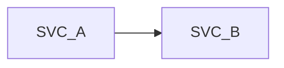
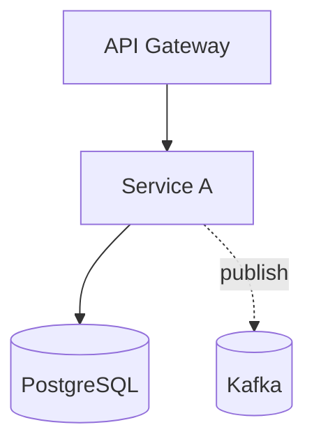

# Low-Level Design Document — [Project Name]

| Field | Value |
|-------|-------|
| Document Title | Low-Level Design — [Project Name] |
| Version | [X.X] |
| Status | [Draft / In Review / Approved] |
| Mode | [from-code / from-sdd / hybrid / partial] |
| Date | [YYYY-MM-DD] |
| Author(s) | [Names] |
| Reviewers | [Names] |
| Approvers | [Names] |
| Related BRD | [path or `Not applicable`] |
| Related SDD | [path or `Not applicable`] |
| Source Code Path | [path or `Not applicable`] |

---

## Changes Log

| Version | Date | Author | Mode | Change Summary |
|---------|------|--------|------|----------------|
| [X.X] | [YYYY-MM-DD] | [Author] | [mode] | Initial LLD draft via lld-unifier. |

---

# 1. Purpose

[One paragraph stating what this LLD enables a developer or AI implementer to do.]

# 2. Scope

## 2.1 In Scope

- [Item]

## 2.2 Out of Scope

- [Item]

# 3. Assumptions

| ID | Assumption | Source | Risk if false |
|----|------------|--------|---------------|
| A-01 | [Assumption] | [BRD / SDD / CLAUDE.md / inferred] | [Risk] |

# 4. Glossary

| Term | Definition | Source |
|------|------------|--------|

# 5. Context

## 5.1 Bounded Context

[One paragraph.]

## 5.2 Upstream Producers

| Upstream | Interaction | Protocol | Notes |
|----------|-------------|----------|-------|

## 5.3 Downstream Consumers

| Downstream | Interaction | Protocol | Notes |
|------------|-------------|----------|-------|

## 5.4 Cross-Service Dependencies



# 6. Architecture Overview

## 6.1 Component Topology



## 6.2 Deployment Topology

| Concern | Choice | Source |
|---------|--------|--------|
| Container | Docker | CLAUDE.md default |
| Orchestrator | Kubernetes (Helm) | CLAUDE.md default |
| Replicas | [N min / M max] | [SDD §14] |

## 6.3 Runtime Stack

| Layer | Technology | Version | Source |
|-------|-----------|---------|--------|
| Language | Java | 21 | CLAUDE.md |
| Framework | Spring Boot | 3.5+ | CLAUDE.md |
| Database | PostgreSQL | 17+ | CLAUDE.md |
| Broker | Kafka | [version] | CLAUDE.md |
| Auth | Keycloak | [version] | CLAUDE.md |
| Migrations | Flyway | [version] | CLAUDE.md |

## 6.4 Architectural Style — As Operationalised

[Concrete operationalisation of the SDD §8.1 style.]

---

# 7. Per-Service Implementation

> **Note:** in COMBINED mode, each service spec is a `### 7.X` block in this document. In CHUNKS mode, each service is its own file at `04-implementation/<service-slug>.md`. Use the chunked-template detail (`chunks/04-implementation-template.md`) as the structure for each service block below — the structure does not change.

## 7.1 [Service Name 1]

### Responsibility

### Class & Interface Map
- Controllers, Services, ServiceImpls, Repositories, Domain types (records), Method signatures

### Method Pseudocode (non-trivial)

### Design Patterns Applied
For each applied pattern: name, triggering CLAUDE.md rule, roles, rationale, Mermaid class diagram, pseudocode skeleton.

### Dependency Injection Graph

### Transaction Boundaries

### Error Handling
RFC 9457 mapping per exception.

### Use-Case Workflows
Per use case: control flow, sequence diagram (Mermaid), idempotency points, outbox emission, retry/timeout.

## 7.2 [Service Name 2]

[Repeat block.]

---

# 8. Data Model

## 8.1 ERD

```mermaid
erDiagram
```

## 8.2 Tables (per service schema)

## 8.3 Indexes

## 8.4 Multi-Tenancy Strategy

## 8.5 Migration Plan (Flyway)

## 8.6 Retention & Archival

## 8.7 Encryption

# 9. API Contracts

## 9.1 Endpoint Inventory

## 9.2 Request / Response Shapes

## 9.3 Authentication & Authorisation

## 9.4 Pagination, Sorting, Filtering

## 9.5 OpenAPI Snippets

# 10. Event Contracts

## 10.1 Topic Inventory

## 10.2 Event Schemas

## 10.3 Producer Specs

## 10.4 Consumer Specs

## 10.5 DLQ Strategy

# 11. State Machines & Business Rules

## 11.1 Aggregate State Machines

## 11.2 Cross-Service Business Rules

## 11.3 Algorithm Pseudocode (non-trivial)

# 12. Cross-Cutting Concerns

## 12.1 Authentication & Tenant Resolution

## 12.2 Idempotency

## 12.3 Resilience (Resilience4j defaults)

## 12.4 Outbox Pattern

## 12.5 Saga Pattern

## 12.6 Error Model (RFC 9457)

## 12.7 Logging

## 12.8 Tracing

## 12.9 Configuration

## 12.10 Health & Readiness

# 13. Operations

## 13.1 Configuration (per service)

## 13.2 Health & Readiness

## 13.3 Metrics (RED)

## 13.4 Logs

## 13.5 Tracing

## 13.6 Dashboards

## 13.7 Alerts

## 13.8 Runbook Procedures

## 13.9 On-Call

# 14. Security

## 14.1 Data Classification

## 14.2 PII Inventory

## 14.3 Secrets Management

## 14.4 Authentication / Authorisation Decisions

## 14.5 Threat Notes

## 14.6 Compliance

# 15. Performance

## 15.1 SLOs

## 15.2 Caching Strategy

## 15.3 Hot-Path Indexes

## 15.4 Bulkhead & Concurrency

## 15.5 Peak Scenarios

## 15.6 Load-Test Strategy

# 16. Testing

## 16.1 Test Pyramid

## 16.2 Unit Conventions (JUnit 5 + Mockito)

## 16.3 Integration Conventions (Testcontainers)

## 16.4 Contract Tests

## 16.5 Frontend Tests (if applicable)

## 16.6 Test Data Strategy

## 16.7 CI Gates

# 17. Frontend

> **Conditional section.** Generate only when the project has a UI surface (Angular, React, etc.). Omit entirely otherwise — do not stub.

## 17.1 Module / Component Tree

## 17.2 State Management Boundaries

## 17.3 Routing

## 17.4 PrimeNG Components Used

## 17.5 Theming

## 17.6 i18n

## 17.7 Accessibility (WCAG 2.1 AA)

## 17.8 Form Conventions

## 17.9 Component Architecture

# 18. Open Questions & Flag Index

## 18.1 Drift Markers (hybrid only)

## 18.2 Low-Confidence (TODO)

## 18.3 Medium-Confidence (Confirm)

## 18.4 Decisions Pending

## 18.5 Inference Confidence Summary

# 19. References

## 19.1 Source Documents (BRD, SDD, code repo)

## 19.2 Architectural Decision Records

## 19.3 OpenAPI Specifications

## 19.4 Event Schemas

## 19.5 Runbooks

## 19.6 Threat Model

## 19.7 External References

## 19.8 Related LLDs

---

# 20. Specs

<!--
Constitution-grade summary, owned by lld-unifier and authored AFTER the LLD body. Synthesised from the source SDD: Mission from SDD §1 (2-3 sentences, core idea only), Tech Stack from SDD §6 verbatim with version pins (must equal §6.3 Runtime Stack above - a mismatch is drift to flag), Roadmap from SDD §13 + BRD UC ownership (3-6 delivery phases), Project Type from intake with the LLD direction taken. Direct input for speckit /constitution. Tone: short, precise, declarative. See chunks/17-specs.md for the full skeleton.
-->

## 20.1 Mission

[2-3 sentences. Core idea only.]

## 20.2 Tech Stack

- **Backend:** [Language + framework + version] 
- **Frontend:** [Framework + version] | Not applicable.
- **Mobile:** [Platform + framework] | Not applicable.
- **Data:** [Primary store + version]
- **Messaging:** [Broker] | Not applicable.

## 20.3 Roadmap

| Phase | Scope (one line) | Services / UC IDs |
|-------|------------------|-------------------|
| P1 - [Label] | [Scope] | [services; UC IDs] |

## 20.4 Project Type

**Selected:** [Greenfield | Brownfield] — **Justification:** [one line]. **LLD direction taken:** [from-sdd | from-code | hybrid].

---

# 21. Open Items & Clarifications

<!--
Output of the post-generation cleared-context reviewer pass. Captures implementation-level gaps, missing edge cases, pattern misapplications, error path concerns, contract drift vs the SDD's Centralized Event Hub (§14) and User Roles catalogue (§16), and Specs-body mismatches. Each item carries options.
This section complements (does not replace) §18, which is the author-generated index of inline `> Confirm:` and `> TODO:` flags. §21 captures the external reviewer's adversarial findings.
-->

## 21.1 How to read each item

| Field | Meaning |
|-------|---------|
| **ID** | OI-NN. Stable across revisions. |
| **Where** | Service name + sub-section, or "global". |
| **Type** | Implementation gap / Missing edge case / Pattern misapplication / Error path / Concurrency hazard / Transaction boundary / Idempotency gap / Multi-tenancy leak / Test gap / Drift / Contract drift (vs SDD §14/§16) / Specs-body mismatch / Duplication (SDD content restated instead of referenced). |
| **Concern** | One paragraph. What was missed and why it matters. |
| **Options** | At least 2 concrete choices, each with a one-line tradeoff. |
| **Recommendation** | REQUIRED. The reviewer's suggested option — always pick one, even for close calls. |
| **Why** | REQUIRED. One or two lines: the reason the recommended option wins — the evidence (CLAUDE.md rule, SDD contract, code fact, risk avoided) and the tradeoff accepted. Never empty. |
| **Status** | Open / Resolved / Deferred. |

## 21.2 Open Items

### OI-01: [Short title]

- **Where:** [Service / sub-section, or "global"]
- **Type:** [Implementation gap | Missing edge case | Pattern misapplication | Error path | Concurrency hazard | Transaction boundary | Idempotency gap | Multi-tenancy leak | Test gap | Drift | Duplication]
- **Concern:** [One paragraph.]
- **Options:**
  - **A.** [Option A] — [one-line tradeoff].
  - **B.** [Option B] — [one-line tradeoff].
- **Recommendation:** [Suggested option letter + the concrete change.]
- **Why:** [The reason this option wins: evidence + tradeoff accepted.]
- **Status:** Open

<!-- Repeat OI block for each open item. -->

## 21.3 Resolution Log

| ID | Resolution Date | Resolved In | Outcome |
|----|----------------|-------------|---------|
| [OI-XX] | [YYYY-MM-DD] | [Service / sub-section] | [Option chosen — short note] |

## 21.4 Reviewer Notes

- [Note 1]
- [Note 2]
