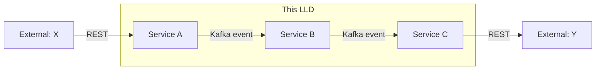

<!--
CHUNK: 02
TITLE: Context — Bounded Context & System Neighbours
PROJECT: [Project Name]
VERSION: [X.X]
PART OF: LLD - [Project Name]
-->

# 5. Context

## 5.1 Bounded Context

<!-- One paragraph. What is the bounded context this LLD covers? -->

[Bounded context statement.]

## 5.2 Upstream Producers (callers / event-publishers into this system)

| Upstream | Interaction | Protocol | Notes |
|----------|-------------|----------|-------|
| [System / Service] | [Sync REST / Async event / Schedule] | [HTTPS / Kafka / gRPC] | [Notes] |

## 5.3 Downstream Consumers (systems this LLD's services call / publish to)

| Downstream | Interaction | Protocol | Notes |
|------------|-------------|----------|-------|
| [System / Service] | [Sync REST / Async event / Schedule] | [HTTPS / Kafka / gRPC] | [Notes] |

## 5.4 Cross-Service Dependencies (within this LLD)

> **Convention:** keep this diagram service-level (not class-level). Class-level wiring lives in `04-implementation/<service>.md`.

> Miro: [optional whiteboard view URL]

## 5.5 Shared Conventions (apply to every service in scope)

- **Auth:** [Keycloak realm strategy / OAuth2 server / mTLS — per CLAUDE.md default unless overridden]
- **Tenant resolution:** [Header / JWT claim / subdomain — per CLAUDE.md multi-tenancy strategy]
- **Correlation ID:** [Header name and propagation rule]
- **Time zone:** UTC for all timestamps (CLAUDE.md default).
- **ID strategy:** UUIDv7 generated at the service layer (CLAUDE.md default).

<!-- MASTER: lld-master.md | PREV: 01-purpose-and-scope.md | NEXT: 03-architecture.md -->
