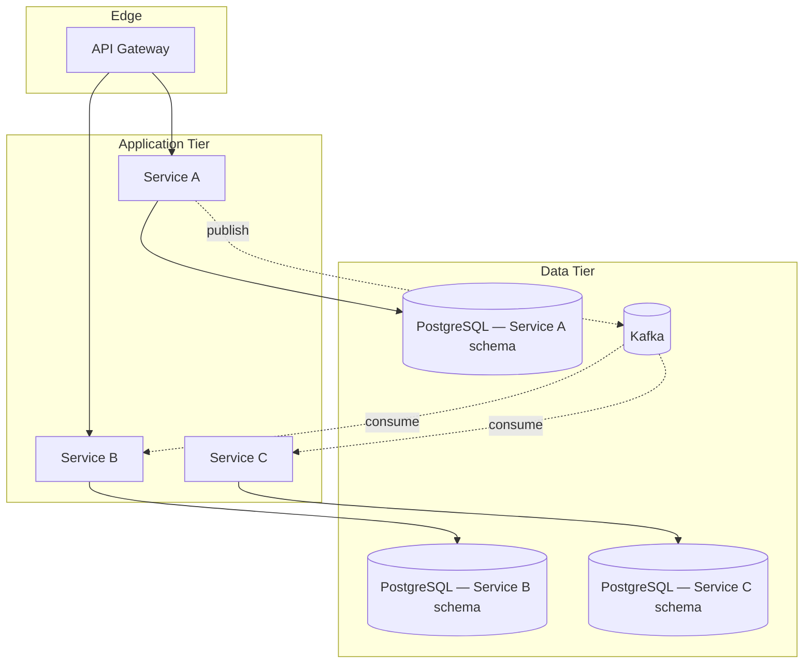

<!--
CHUNK: 03
TITLE: Architecture Overview — Components & Deployment
PROJECT: [Project Name]
VERSION: [X.X]
PART OF: LLD - [Project Name]
-->

# 6. Architecture Overview

> **Note:** this chunk is a high-level orientation. Per-service detail lives in `04-implementation/<service>.md`. If you need class-level or method-level detail, jump straight there.

## 6.1 Component Topology

> Miro: [optional whiteboard view URL]

## 6.2 Deployment Topology

| Concern | Choice | Source / Rationale |
|---------|--------|--------------------|
| Container | Docker (one image per service) | CLAUDE.md default |
| Orchestrator | Kubernetes (Helm chart per service) | CLAUDE.md default |
| Namespace strategy | [Per-environment / Per-tenant / Hybrid] | [SDD §15 if applicable] |
| Service mesh / Ingress | [Istio / Linkerd / NGINX Ingress / API Gateway alone] | [SDD §6 if applicable] |
| Replicas (per service, baseline) | [N min / M max] | [SDD §14 if applicable] |
| Deployment strategy | [Rolling / Blue-Green / Canary] | [Per-service overrides in `04-implementation/<svc>.md`] |

## 6.3 Runtime Stack

| Layer | Technology | Version | Source |
|-------|-----------|---------|--------|
| Language | Java | 21 | CLAUDE.md default |
| Framework | Spring Boot | 3.5+ | CLAUDE.md default |
| Build | [Maven / Gradle] | [version] | [Source] |
| Database | PostgreSQL | 17+ | CLAUDE.md default |
| Message Broker | Kafka | [version] | CLAUDE.md default (on-prem) |
| Cache | [Redis / Caffeine / None] | [version] | [Source] |
| Auth | Keycloak | [version] | CLAUDE.md default (on-prem) |
| Migrations | Flyway | [version] | CLAUDE.md default |
| Observability | [Prometheus + Grafana + Loki + Tempo / other] | [version] | [Source] |
| Frontend (if applicable) | Angular | 17+ | CLAUDE.md default |

> **Convention:** any value flagged `> Confirm:` here means the SDD/code did not pin it; the row uses CLAUDE.md default but should be verified.

## 6.4 Architectural Style — As Operationalised

> **Inherits from:** SDD §8.1 Architecture Style.
>
> **What this section adds:** the concrete operationalisation. Where the SDD says "event-driven microservices", this section names the topics, the consumer-group conventions, the schema-registry choice, the outbox-table convention.

- **Service boundary rule:** one service = one bounded context = one private PostgreSQL schema. No cross-schema reads.
- **Inter-service async:** Kafka topics named `<context>.<entity>.<event>`. JSON Schema in [registry] (or Avro in [registry]).
- **Inter-service sync:** [allowed for / forbidden — per CLAUDE.md "no service-to-service chained REST calls more than one hop deep"].
- **Outbox pattern:** mandatory for every state-changing event. Implementation per `09-cross-cutting.md` § Outbox.
- **Saga choreography vs orchestration:** [default per CLAUDE.md — choreography unless flow is complex; orchestrator-owning service named per case].

<!-- MASTER: lld-master.md | PREV: 02-context.md | NEXT: 04-implementation/<service>.md -->
