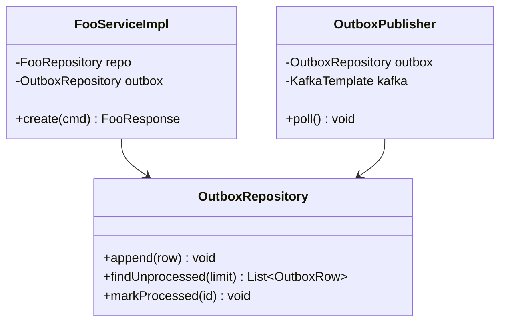
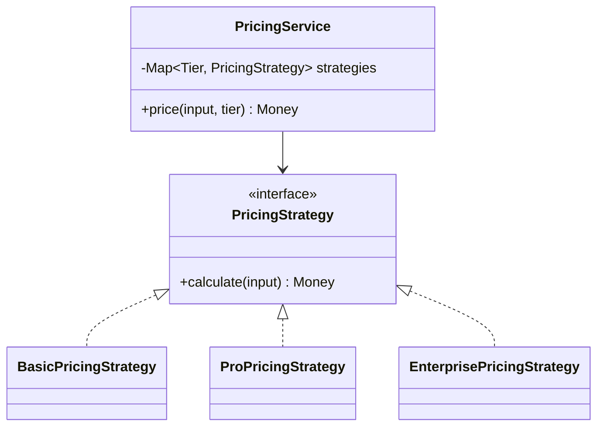
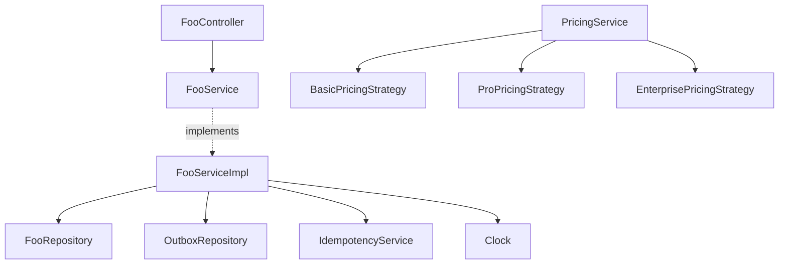
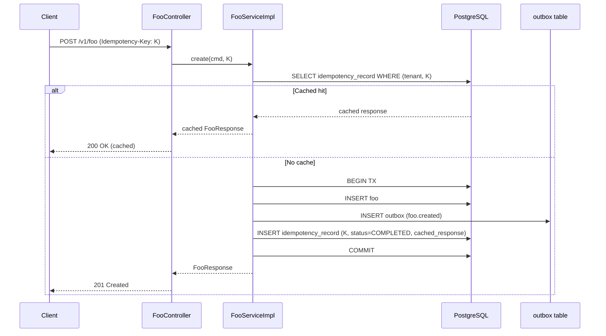
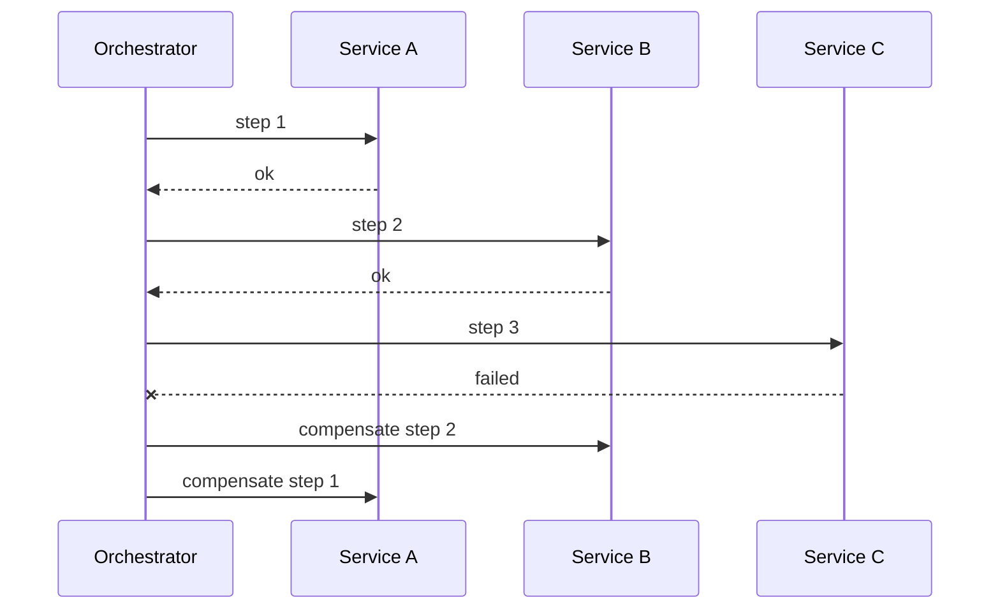

<!--
CHUNK: 04
TITLE: Per-Service Implementation - [Service Name]
PROJECT: [Project Name]
VERSION: [X.X]
DEPENDS_ON: 03, 09
PART OF: LLD - [Project Name]
NOTE: This is the TEMPLATE for a single service. In CHUNKS shape, copy this file as
      ./lld-[project-slug]/04-implementation/[service-slug].md per service.
      Cross-service sagas live with the orchestrator service's file.
-->

# 7. Per-Service Implementation — [Service Name]

> **Bounded context:** [SDD §13.X reference / inferred from code path]
>
> **Source code:** [path/to/service]
>
> **Owns workflows:** [list use cases this service owns or orchestrates]

---

## 7.1 Responsibility

<!-- One paragraph. What is this service's single responsibility? Bounded-context level, not implementation level. -->

[Responsibility statement.]

---

## 7.2 Class & Interface Map

> **Convention:** list the load-bearing classes only — controllers, services, service implementations, repositories, mappers, key domain types. Skip DTOs that are obvious from controller signatures.

### Controllers

| Class | Endpoints | Notes |
|-------|-----------|-------|
| `[FooController]` | `[GET /v1/foo/{id}, POST /v1/foo, ...]` | [Auth scope, idempotency rules] |

### Services (interfaces)

| Interface | Purpose | Implementations |
|-----------|---------|-----------------|
| `[FooService]` | [What this service interface defines] | `[FooServiceImpl]` |

### Service Implementations

| Class | Implements | Key methods |
|-------|------------|-------------|
| `[FooServiceImpl]` | `[FooService]` | `[create(...)]`, `[update(...)]`, `[query(...)]` |

### Repositories

| Class | Entity | Notes |
|-------|--------|-------|
| `[FooRepository]` | `[Foo]` | [Spring Data JPA / JDBC, custom queries if any] |

### Domain Types (records)

| Type | Kind | Purpose |
|------|------|---------|
| `[FooDto]` | record | [Inbound DTO for FooController.create] |
| `[FooResponse]` | record | [Outbound response from FooController.get] |
| `[Foo]` | entity | [Aggregate root for the foo bounded context] |

### Method Signatures (key methods only)

```java
// FooService
public interface FooService {
  FooResponse create(CreateFooCommand cmd, IdempotencyKey key);
  FooResponse update(UUID id, UpdateFooCommand cmd, IdempotencyKey key);
  Optional<FooResponse> findById(UUID id);
  Page<FooResponse> query(FooQuery query, Pageable pageable);
}
```

> **Convention:** records are used for all DTOs (CLAUDE.md default). Constructor injection only — no `@Autowired` on fields.

---

## 7.3 Method-Level Pseudocode (non-trivial logic only)

> **Convention:** include pseudocode only for methods where the algorithm is non-obvious. Skip for plain CRUD.

### `[FooServiceImpl.create]`

```text
1. Validate idempotency key:
   - Look up (tenant_id, idempotency_key) in idempotency_record table.
   - If found: return cached response.
   - If found but in-flight: return 409 Conflict (per CLAUDE.md error model).
2. Validate command (Bean Validation + domain rules).
3. Begin transaction.
4. Persist Foo aggregate.
5. Append outbox row (foo.created event payload, target topic).
6. Persist idempotency_record (status=COMPLETED, response cached).
7. Commit transaction.
8. Return FooResponse.
```

> **Confidence:** [High — confirmed in code at [file:line] / Medium — inferred from FR-NN / Low — best-guess from sequence flow]

---

## 7.4 Design Patterns Applied

> **Convention:** every applied pattern carries name, triggering CLAUDE.md rule, roles, rationale specific to this service, Mermaid class diagram, and pseudocode skeleton. Patterns inferred from code (from-code) include `> Confirm:` if pattern detection used semantic heuristics; patterns proposed (from-sdd) carry the rule attribution explicitly.

### Pattern: Outbox

> **Applied:** Outbox pattern (CLAUDE.md: "Outbox pattern is mandatory for any state change that must produce an event. No dual-writes to DB and Kafka.")
>
> **Rationale (this service):** [State changes in foo emit `foo.created` and `foo.updated` events to downstream consumers. Direct dual-write to DB+Kafka would risk inconsistency on failure; outbox guarantees the event survives DB commit and is published asynchronously.]

**Roles:**

| Role | Class / Component | Notes |
|------|-------------------|-------|
| Outbox table | `outbox` table in service schema | Append-only; columns: id, aggregate_type, aggregate_id, event_type, payload, created_at, processed_at |
| Outbox writer | `FooServiceImpl.create` (within tx) | Inserts outbox row inside the same transaction as the aggregate write |
| Outbox publisher | `OutboxPublisher` (scheduled) | Polls unprocessed rows, publishes to Kafka, marks processed |

**Class diagram:**



**Pseudocode skeleton:**

```text
@Scheduled(fixedDelay = 1s)
void poll() {
  rows = outbox.findUnprocessed(BATCH_SIZE);
  for row in rows {
    kafka.send(topic = row.target_topic, key = row.aggregate_id, payload = row.payload);
    outbox.markProcessed(row.id);
  }
}
```

### Pattern: Strategy (example)

> **Applied:** Strategy pattern (CLAUDE.md: "Strategy for runtime variants")
>
> **Rationale (this service):** [Pricing rules differ per tenant tier (basic, pro, enterprise). Hard-coding the variants in a single method would couple tier addition to a code change in `PricingServiceImpl`. Strategy decouples each tier's calculation into its own class, picked at runtime by tenant tier.]

**Roles:**

| Role | Class / Component |
|------|-------------------|
| Strategy interface | `PricingStrategy` |
| Concrete strategies | `BasicPricingStrategy`, `ProPricingStrategy`, `EnterprisePricingStrategy` |
| Context | `PricingService` — selects strategy by tenant tier |

**Class diagram:**



**Pseudocode skeleton:**

```text
class PricingService {
  Map<Tier, PricingStrategy> strategies; // injected by Spring

  Money price(input, tier) {
    return strategies.get(tier).calculate(input);
  }
}
```

<!-- Repeat one Pattern subsection per pattern applied: Factory Method, Mediator, Chain of Responsibility, Saga, Template Method, Facade, Composition over inheritance, etc. Always include the four parts: triggering rule, rationale, roles, Mermaid + pseudocode. -->

> **Note:** for from-sdd mode, every pattern triggered by a CLAUDE.md rule MUST be applied here (not just suggested). For from-code mode, only patterns *actually* present in code are documented; inferred-but-uncertain pattern detections are flagged with `> Confirm: pattern detected via [heuristic]`.

---

## 7.5 Dependency Injection Graph

> **Convention:** constructor injection only. Document the wiring graph for non-trivial cases (3+ collaborators, or any factory/strategy/mediator wiring).



---

## 7.6 Transaction Boundaries

| Method | Propagation | Isolation | Rollback rules |
|--------|-------------|-----------|----------------|
| `[FooServiceImpl.create]` | `REQUIRED` | `READ_COMMITTED` | rollback on `ServiceException`, no rollback on `IdempotencyHitException` |
| `[FooServiceImpl.update]` | `REQUIRED` | `REPEATABLE_READ` | rollback on `ServiceException`, no rollback on `OptimisticLockException` (caller-handled retry) |

> **Convention:** outbox row insert lives inside the same transaction as the aggregate write. No `@Transactional(propagation = REQUIRES_NEW)` for outbox writes — the whole point of the pattern is one-tx commit.

---

## 7.7 Error Handling

| Exception | RFC 9457 type | HTTP Status | When thrown | Caller action |
|-----------|---------------|-------------|-------------|---------------|
| `FooNotFoundException` | `https://errors.example.com/foo/not-found` | 404 | Foo with given ID does not exist for this tenant | None (terminal) |
| `FooValidationException` | `https://errors.example.com/foo/validation` | 400 | Bean Validation or domain rule failed | Fix payload, retry |
| `IdempotencyConflictException` | `https://errors.example.com/idempotency/conflict` | 409 | Same idempotency key in-flight on a different request | Wait + retry, OR use a new key |
| `FooConcurrencyException` | `https://errors.example.com/foo/concurrency` | 409 | Optimistic lock failure | Re-fetch and retry |

> **Convention:** all exceptions extend `ServiceException` (CLAUDE.md base class). Global `@RestControllerAdvice` translates to `ProblemDetails` (RFC 9457). Error envelope schema in `09-cross-cutting.md` § Error Model.

---

## 7.8 Use-Case Workflows

> **Convention:** one subsection per use case this service owns. Cross-service sagas live in the orchestrator service's file. Each workflow has: control flow, sequence diagram (Mermaid), idempotency points, outbox emission points, retry/timeout choices.

### UC-01: [Use Case Name]

**Trigger:** [REST endpoint / Kafka event consumer / Scheduled task / Other]

**Pre-conditions:** [What must be true before this flow]

**Post-conditions:** [What is true after a successful flow]

**Control flow:**

```text
1. [Step]
2. [Step]
3. [Step — outbox emission point: emits foo.created]
4. [Step]
5. [Idempotency check: ...]
6. [Step]
```

**Sequence diagram:**



> Miro: [optional whiteboard view URL]

**Idempotency points:** [Header `Idempotency-Key` required on POST; (tenant_id, key) is the dedup tuple; TTL 24h on the cached record]

**Outbox emission points:** [foo.created event emitted in step 3; topic `foo.lifecycle.created`; key = aggregate ID for per-aggregate ordering]

**Retry / timeout policy:** [Outbox publisher retries with exponential backoff (Resilience4j); after 5 failures, row stays unprocessed and an alert fires]

**Error handling:** [Validation → 400 + FooValidationException; idempotency conflict → 409; DB failure → 500 + retry-after header]

### UC-02: [Use Case Name]

<!-- Repeat structure for each use case. -->

### Cross-service Saga (orchestrator role)

> **Only present if this service is the orchestrator of a multi-service saga.** Choreography-style sagas (each service reacts to events without an orchestrator) are documented per-step in the participating services' workflow sections.

**Saga name:** [SAGA-NN: Name]

**Participating services:** [List]

**Steps:**

| Step | Service | Action | Compensating action | Idempotency |
|------|---------|--------|---------------------|-------------|
| 1 | [svc-a] | [Action] | [Compensation] | [Key strategy] |
| 2 | [svc-b] | [Action] | [Compensation] | [Key strategy] |
| 3 | [svc-c] | [Action] | [Compensation] | [Key strategy] |

**Compensation triggers:** [Conditions that trigger rollback through the chain]

**Sequence diagram:**



<!-- MASTER: lld-master.md | PREV: 03-architecture.md | NEXT: 05-data-model.md -->
