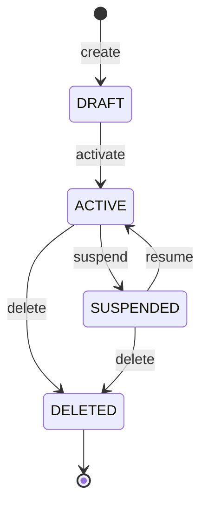

<!--
CHUNK: 08
TITLE: State Machines & Business Rules
PROJECT: [Project Name]
VERSION: [X.X]
DEPENDS_ON: 04
PART OF: LLD - [Project Name]
-->

# 11. State Machines & Business Rules

> **Convention:** include a state machine only for entities that are genuinely stateful with named states. Stateless services have no state machine here. Per-service rules that are mostly local stay in `04-implementation/<service>.md`; rules that span services live here.

## 11.1 Aggregate State Machines

### `Foo` aggregate (in `[service-a]`)

**States:** `DRAFT`, `ACTIVE`, `SUSPENDED`, `DELETED` (soft).



**Transition rules:**

| From | Event | To | Guard | Side effect |
|------|-------|----|----|-------------|
| `DRAFT` | `activate` | `ACTIVE` | All required fields populated | Emit `foo.activated` |
| `ACTIVE` | `suspend` | `SUSPENDED` | Caller has `foo:suspend` scope | Emit `foo.suspended` |
| `SUSPENDED` | `resume` | `ACTIVE` | Suspension reason resolved | Emit `foo.resumed` |
| `ACTIVE` | `delete` | `DELETED` | No active dependencies | Emit `foo.deleted` |

> **Invariants enforced at every transition:**
> - Optimistic lock version must match.
> - Tenant ID immutable.
> - Created-at immutable.

## 11.2 Cross-Service Business Rules

> **Rules that one service depends on another to enforce.** When you change a rule here, check downstream consumers.

### Rule: [Rule Name]

**Statement:** [One-sentence rule.]

**Source of truth:** [Which service owns this rule]

**Enforcement points:** [Which services / endpoints / consumers must respect it]

**Validation matrix:**

| Input condition | Expected outcome |
|-----------------|------------------|
| [Condition] | [Outcome] |
| [Condition] | [Outcome] |

## 11.3 Algorithm Pseudocode (non-trivial only)

> **Convention:** include only algorithms whose correctness isn't obvious from the code structure. Skip plain loops, plain CRUD, plain validation.

### Algorithm: [Name]

**Input:** [Inputs]

**Output:** [Outputs]

```text
[Pseudocode]
```

**Edge cases:** [List]

**Complexity:** [Big-O]

<!-- MASTER: lld-master.md | PREV: 07-event-contracts.md | NEXT: 09-cross-cutting.md -->
