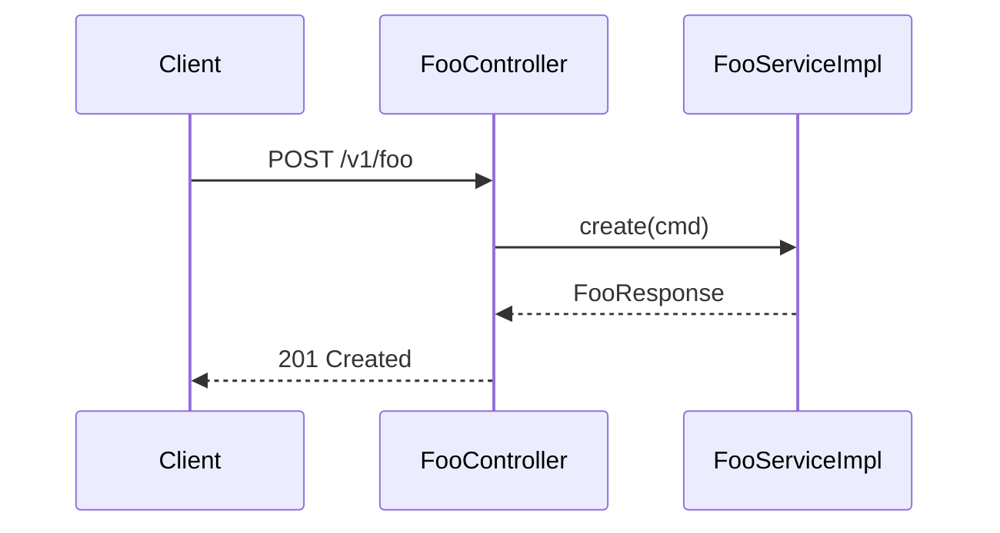
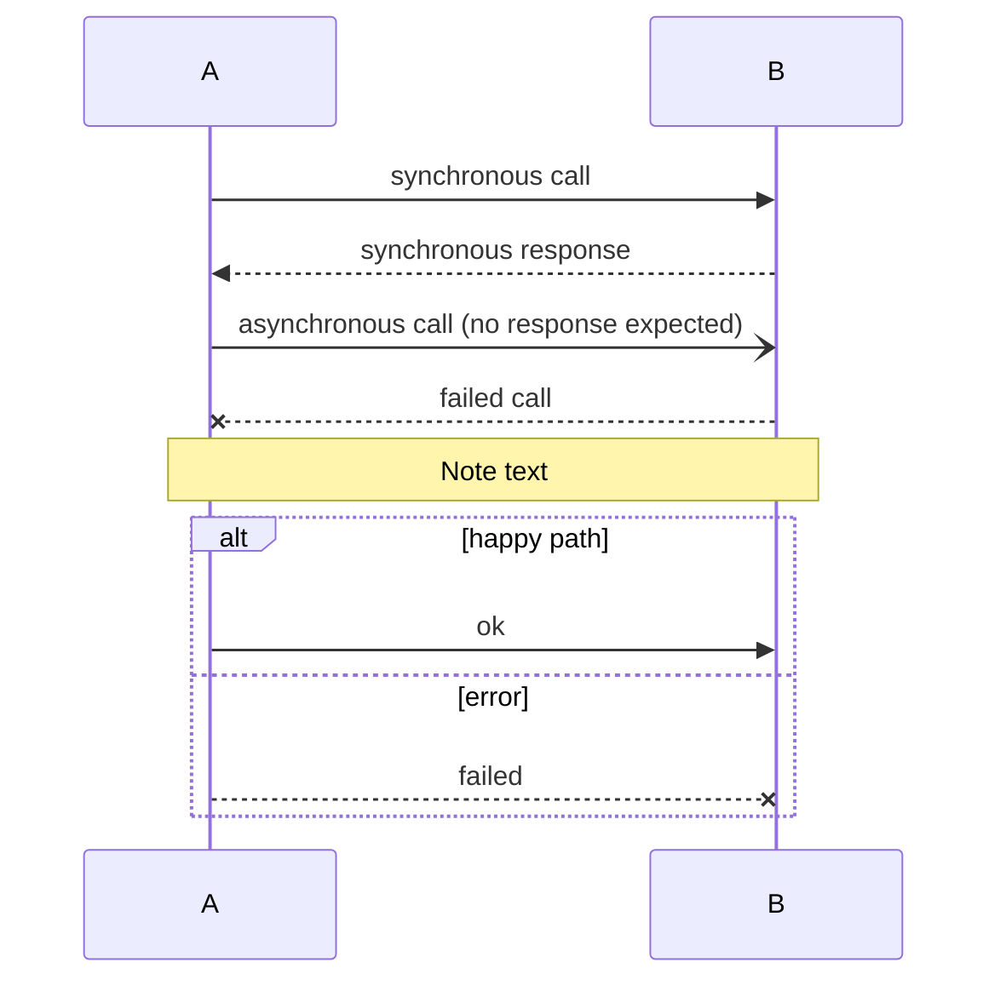
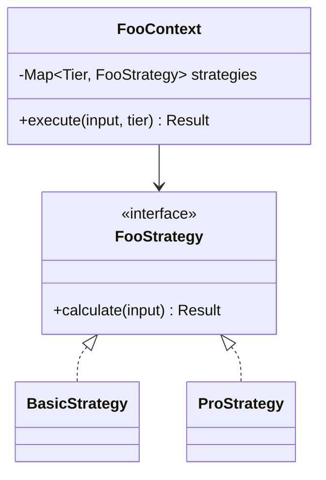
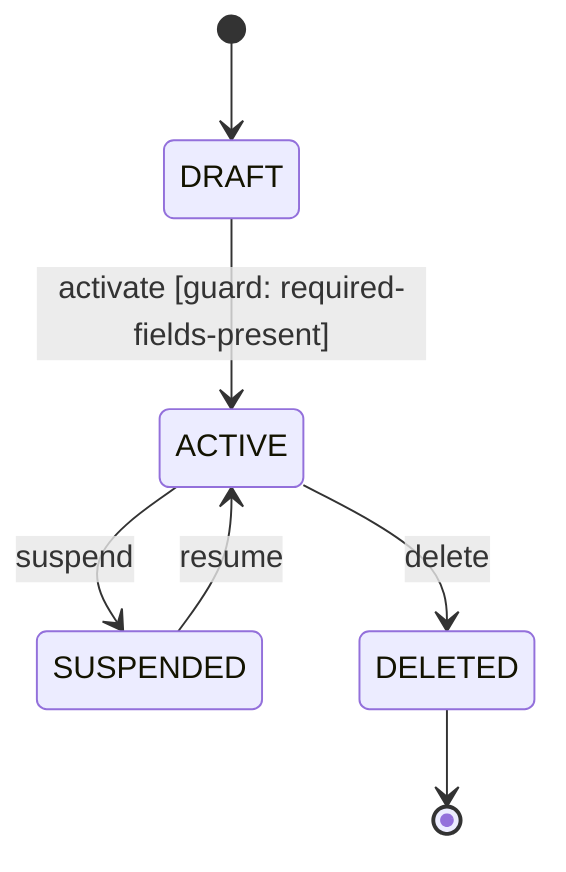
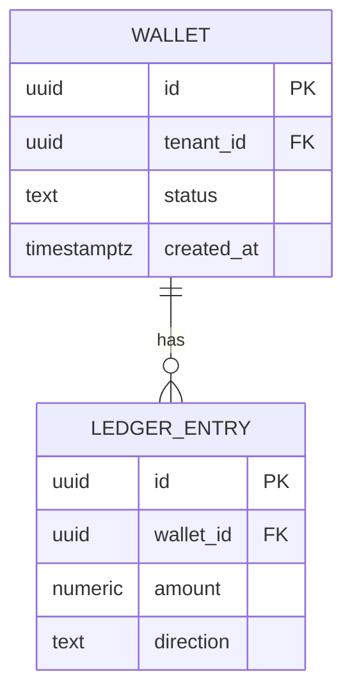
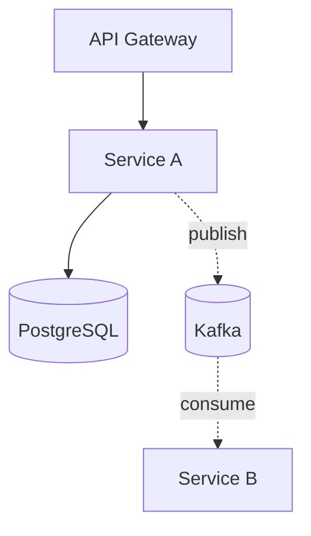

# Mermaid Diagrams (with optional Miro link slots)

LLDs use **inline Mermaid** as the default for sequence, state, ERD, and class diagrams. **Miro links are optional** for whiteboard-richer visuals. This matches the convention across all unifier skills (BRD, SDD, LLD): inline Mermaid is authoritative; Miro boards are produced only on explicit request.

---

## Default diagram-type → format mapping

| Diagram type | Default format | Where it appears | Optional Miro link? |
|--------------|----------------|------------------|---------------------|
| Sequence (per use case) | Mermaid `sequenceDiagram` inline | `04-implementation/<service>.md` § 7.8 | Yes — for cross-team whiteboard view |
| Class diagram (per design pattern) | Mermaid `classDiagram` inline | `04-implementation/<service>.md` § 7.4 | No — pattern diagrams stay inline only |
| State machine | Mermaid `stateDiagram-v2` inline | `08-state-and-rules.md` § 11.1 | Yes — for stakeholder review |
| Entity-relationship | Mermaid `erDiagram` inline | `05-data-model.md` § 8.1 | Yes — for DB review with DBA |
| Component topology | Mermaid `graph TB` inline | `03-architecture.md` § 6.1 | Yes — usually inherited from SDD's Miro board |
| Cross-service dependency graph | Mermaid `graph LR` inline | `02-context.md` § 5.4 | Yes |
| DI graph (per service) | Mermaid `graph TB` inline | `04-implementation/<service>.md` § 7.5 | No — implementation detail |
| Saga flow | Mermaid `sequenceDiagram` inline | `04-implementation/<orchestrator>.md` § 7.8 | Yes — for stakeholder review |
| Workflow / control flow | Mermaid `flowchart TD` inline | `04-implementation/<service>.md` § 7.8 (alternative to sequence for non-actor flows) | Yes |

---

## Mermaid block conventions

Every Mermaid block is fenced:

````markdown

````

**Rules:**

- Always specify the language hint (`mermaid`).
- Use named participants (`participant X as Long Name`) when shorter aliases improve readability.
- Annotate alt-paths for error scenarios.
- Keep diagrams scoped — no diagram should exceed ~30 lines. If it does, split into multiple smaller diagrams (e.g., happy path + error path).

---

## Optional Miro link slot

When a diagram has a richer Miro version (e.g., colour-coded ownership, stakeholder annotations), append a Miro link below the inline Mermaid:

```markdown
```mermaid
[inline Mermaid block]
```

> Miro: https://miro.com/app/board/<board-id>/?moveToWidget=<widget-id>
```

**Convention:**
- The Miro link is *additive*, not replacement. The Mermaid stays.
- The skill never writes a Miro link if no real board exists. Empty placeholders like `> Miro: [TBD]` are not used.
- If the SDD's diagram is on Miro and the LLD inherits it, link to the SDD's existing board — don't create a new LLD-specific board.

---

## Mermaid syntax quick reference (the dialects we use)

### `sequenceDiagram`



### `classDiagram`



Roles:
- `<|--` inheritance.
- `<|..` interface implementation.
- `--*` composition.
- `--o` aggregation.
- `-->` association.

### `stateDiagram-v2`



### `erDiagram`



Cardinalities:
- `||--||` one-to-one.
- `||--o{` one-to-many.
- `}o--o{` many-to-many.

### `graph` / `flowchart`



Node shapes:
- `[ ]` rectangle.
- `( )` rounded.
- `(( ))` circle.
- `[( )]` cylinder (DB).
- `{ }` rhombus (decision).

---

## When NOT to draw a diagram

- Per-getter / per-setter classes — no diagram, just a class table.
- Stateless services — no state machine.
- One-step workflows — no sequence diagram (the description is the diagram).
- Pure CRUD endpoints — no per-endpoint sequence diagram (one global "happy path POST + error" pair covers them all).

The skill leans toward fewer, more meaningful diagrams. A 6-line state machine that describes nothing is worse than no diagram.

---

## Render-fail mitigation

Mermaid syntax errors break the doc. The skill should:

1. Validate every emitted Mermaid block parses (syntactically) before writing.
2. If a block fails to validate, fall back to a plain-text description in a `text` code-fence + a `> TODO: Mermaid syntax error — please review and fix.` flag.
3. Surface the fallback count in the handoff summary.

---

## Cross-LLD diagram conventions

When two LLDs reference the same diagram (e.g., a system-level architecture diagram lives in `wallet-management` LLD but also referenced by `notification-dispatcher` LLD):

- Owning LLD: render Mermaid inline.
- Referencing LLD: link to the owning LLD's chunk by relative path; do NOT duplicate the Mermaid.

```markdown
> See `../wallet-management/lld/03-architecture.md` § 6.1 Component Topology for the system-wide diagram.
```
