# [Project / Product Name]: Solution Design Document (SDD)

**Project / Product Name:** [Project Name]
**Version:** [X.X]
**Status:** [Draft | In Review | Approved]
**Author:** [Author Name]
**Reviewers:** [Reviewer Name(s)]
**Approvers:** [Approver Name(s)]
**Date:** [YYYY-MM-DD]
**Related BRD:** [Link / file name of the corresponding BRD-HLD]

---

## Changes Log

| Version | Updated Date | Updated By | Reviewed By | Approved By | Update Summary |
|---------|--------------|------------|-------------|-------------|----------------|
| 1.0     | YYYY-MM-DD   | [Name]     |             |             | Initial draft. |

---

## Table of Contents

<!-- Auto-generated or manually maintained. Include Figures and Tables indices if the document is large. -->

**Figures**

| Figure # | Title | Section |
|----------|-------|---------|
| Figure 1 | [Title] | [Section] |

**Tables**

| Table # | Title | Section |
|---------|-------|---------|
| Table 1 | [Title] | [Section] |


---


# 1. Executive Summary

<!--
Technical executive summary, complementary to the BRD executive summary.
Focus: what the system is technically, the architecture style at a glance, the key technology pillars, and the technical bets.
Audience: engineering leadership, architects, senior developers, SRE/DevOps.
2-4 paragraphs.
-->

[Technical description of the system.]

[Architecture style and primary technical objectives.]

Core technical capabilities at a glance:

- [Capability 1]
- [Capability 2]
- [Capability 3]

Key technical bets and trade-offs:

- [Bet 1 and rationale]
- [Bet 2 and rationale]

---

# 2. Scope

## 2.1 In Scope

<!-- Solution-design-level scope. What this SDD will detail and what the team commits to design and build. -->

- [Solution scope item 1]
- [Solution scope item 2]
- [Solution scope item 3]

## 2.2 Out of Scope

<!-- Explicitly excluded from this SDD. Reference the deferral reason or the document where it is handled. -->

- [Out-of-scope item 1, with justification or deferral note]
- [Out-of-scope item 2]

---

# 3. Assumptions

<!-- Numbered list. Each assumption should be testable and unambiguous. Anything that, if false, would invalidate the design. -->

1. **[Short Label]:** [Detailed assumption description].
2. **[Short Label]:** [Detailed assumption description].
3. **[Short Label]:** [Detailed assumption description].

---

# 4. Risks

<!--
List of technical and architectural risks. Each risk includes likelihood, impact, and a mitigation.
Owner: who will own the mitigation and the monitoring of the risk.
-->

| Risk ID | Description | Likelihood (L/M/H) | Impact (L/M/H) | Mitigation | Owner |
|---------|-------------|--------------------|----------------|------------|-------|
| R-01    | [Risk description] | [L/M/H] | [L/M/H] | [Mitigation] | [Owner] |
| R-02    | [Risk description] | [L/M/H] | [L/M/H] | [Mitigation] | [Owner] |

---

# 5. Glossary

| Term | Definition |
|------|------------|
| [Term 1] | [Definition] |
| [Term 2] | [Definition] |


---


# 6. Ecosystem Overview

<!--
Summary of the platform-wide technology stack and shared infrastructure that all services in this SDD must conform to.
This section is the single source of truth for the implementation constitution and planned technology choices.
SELECTION FLOW: this table is never filled silently. Per SKILL.md § Ecosystem selection, the skill first presents the proposed ecosystem (BRD Technical Inputs verbatim > CLAUDE.md defaults > BRD-informed recommendations) for a one-shot accept-all; if not accepted, it walks the user through the items in grouped batches, highlighting the recommended option per item with the BRD evidence that drives it. Record the outcome per row in the Notes column (e.g., "BRD-mandated", "default accepted", "user override - see ADR-NN").
-->

| Layer | Technology / Service | Version / Tier | Notes |
|-------|----------------------|----------------|-------|
| Architecture Doctrine | [Microservices + EDA (event-driven backbone) + DDD (bounded contexts) + Hexagonal (ports & adapters) per service - the platform default] | n/a | [Confirmed in ecosystem selection; deviations need an ADR] |
| Compute / Infra | [On-prem Kubernetes / EKS / AKS / GKE] | [vX.Y] | [Cluster topology, node groups, multi-AZ, etc.] |
| Container Runtime | [containerd / Docker] | [vX.Y] | [Notes] |
| Service Mesh / Ingress | [Istio / Linkerd / NGINX Ingress / Cloud LB] | [vX.Y] | [mTLS, traffic policies] |
| Primary RDBMS | [PostgreSQL / other] | [Version] | [HA topology, replicas, backups] |
| Caching | [Redis / ElastiCache / other] | [Version] | [Cluster mode, persistence, eviction] |
| Event Broker / Streaming | [Kafka / SNS+SQS / RabbitMQ / ActiveMQ] | [Version] | [Topic strategy, retention, partitions] |
| Object Storage | [S3 / MinIO / Azure Blob / other] | [Tier] | [Bucket strategy, lifecycle policies] |
| IAM / AuthN | [Keycloak / Cognito / Auth0 / other] | [Version] | [Realms, federation, OIDC flows] |
| Secrets Management | [Vault / Secrets Manager / Sealed Secrets] | [Version] | [Rotation policy] |
| API Gateway | [Kong / API Gateway / Spring Cloud Gateway] | [Version] | [Auth, rate limiting, routing] |
| CI/CD | [GitHub Actions / GitLab CI / Jenkins / ArgoCD] | [Version] | [Pipeline standards] |
| Observability: Logging | [Loki / ELK / CloudWatch / other] | [Version] | [Retention, indices] |
| Observability: Metrics | [Prometheus + Grafana / Datadog / other] | [Version] | [Scrape interval, dashboards] |
| Observability: Tracing | [OpenTelemetry + Jaeger / Tempo / X-Ray] | [Version] | [Sampling rate] |
| Backend Runtime | [Language + Framework, e.g., Java 21 / Spring Boot 3.4+] | [Version] | [Layering rules] |
| Frontend Stack | [Framework + UI lib, e.g., Angular / Tailwind / PrimeNG] | [Version] | [Design system, primary color] |
| Reporting / BI | [Tool] | [Version] | [Read-replica or warehouse-backed] |

**Ecosystem-level rules:**

<!-- The first three rules are platform defaults (EDA / DDD / Hexagonal). Keep them unless the user explicitly overrode them during ecosystem selection - an override needs an ADR in §10. -->

- **Event-driven by default (EDA):** every cross-service state change travels as an asynchronous event through the Centralized Event Hub (§14); synchronous REST is reserved for true request-response, capped at one hop. Outbox pattern mandatory - no dual-writes.
- **DDD bounded contexts:** one service owns one bounded context, one database, one team of decisions. No shared schemas across services; the §13 decomposition follows domain boundaries, not technical tiers.
- **Hexagonal architecture (ports & adapters) per service:** domain core isolated from transport and infrastructure; inbound/outbound adapters (REST, messaging, persistence, providers) plug into ports. Provider integrations sit behind anti-corruption adapters.
- [Rule, e.g., timezone - UTC for all datetimes]
- [Rule, e.g., ID strategy - UUIDv7 primary keys]
- [Rule, e.g., service-to-service auth]
- [Rule, e.g., secrets handling]


---


# 7. System Users & Use Cases

## 7.1 Actors

<!-- List all actors (human users and external systems) that interact with the platform. -->

| Actor | Type (Human / System) | Description | Primary Interface |
|-------|-----------------------|-------------|-------------------|
| [Actor 1] | [Human / System] | [Description] | [Interface] |
| [Actor 2] | [Human / System] | [Description] | [Interface] |

## 7.2 Use Case Diagram

**Figure 1: Use Case Diagram**

<!-- Inline Mermaid is the default diagram medium. Carry the UC IDs verbatim from the BRD. Append `> Miro: <url>` only if a richer whiteboard version exists on a real board. -->

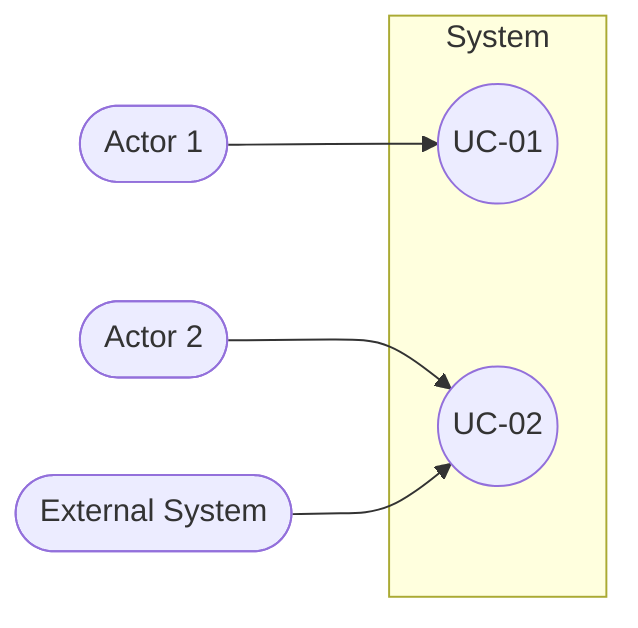

**Summary:** [1-2 sentences: which actors drive which use-case clusters.]


---


# 8. System Design / High-Level Architecture

## 8.1 Architecture Style

### 8.1.1 What

<!-- Name the style. Platform default (per the ecosystem doctrine in §6): microservices with an event-driven async backbone (EDA), DDD bounded contexts, hexagonal (ports & adapters) inside each service. Deviations need an ADR. -->

[Architecture style statement.]

### 8.1.2 Why

<!-- Why this style fits the business and technical objectives. Tie back to NFRs and BRD objectives. -->

- [Reason 1]
- [Reason 2]
- [Reason 3]

### 8.1.3 How

<!-- How the style manifests in this system: bounded contexts, communication patterns, data ownership, deployment model. -->

- **Bounded contexts:** [List of contexts and which service owns each]
- **Inter-service communication:** [Sync vs async; protocols]
- **Data ownership:** [Ownership rules]
- **Deployment model:** [Packaging and orchestration]

## 8.2 Context Diagram

**Figure 2: System Context Diagram**

<!-- Inline Mermaid is the default diagram medium. Label each edge with protocol + purpose. Append `> Miro: <url>` only if a richer whiteboard version exists on a real board. -->


**Summary:** [1-2 sentences: who talks to the system and over what.]

## 8.3 High-Level Architecture Diagram

**Figure 3: High-Level Architecture**

<!-- Inline Mermaid is the default diagram medium. Show the layers: edge, frontend, services, data plane, async backbone, external, observability. -->

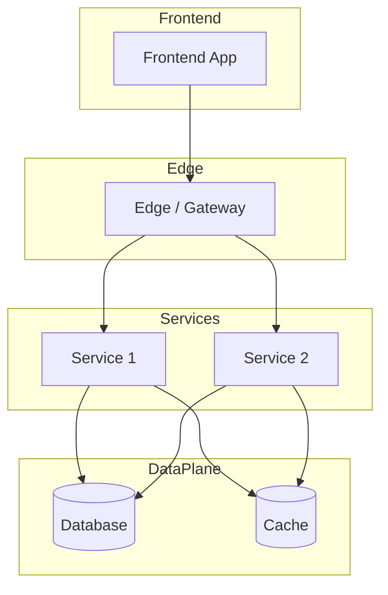

**Summary:** [1-2 sentences: the layer composition and the load-bearing connections.]


---


## 8.4 Workflow Diagrams

<!-- This chunk continues the System Design section from chunk 04 (Architecture Style & Diagrams). -->
<!-- Add one workflow per critical end-to-end business flow. Inline Mermaid is the default diagram medium; each diagram gets a 1-2 sentence prose Summary so it reads without rendering. Append `> Miro: <url>` only if a richer whiteboard version exists on a real board. -->

### 8.4.1 Workflow: [Flow Name]

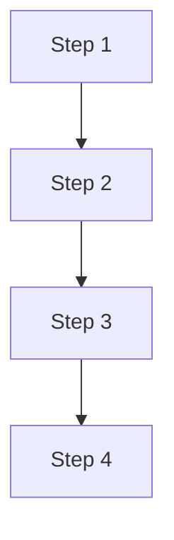

**Summary:** [1-2 sentences describing the flow in prose.]

### 8.4.2 Workflow: [Flow Name]

<!-- Repeat for each critical workflow. -->

## 8.5 Sequence Diagrams

<!-- Add one sequence diagram per critical interaction (sync + async). -->

### 8.5.1 Sequence: [Flow Name]

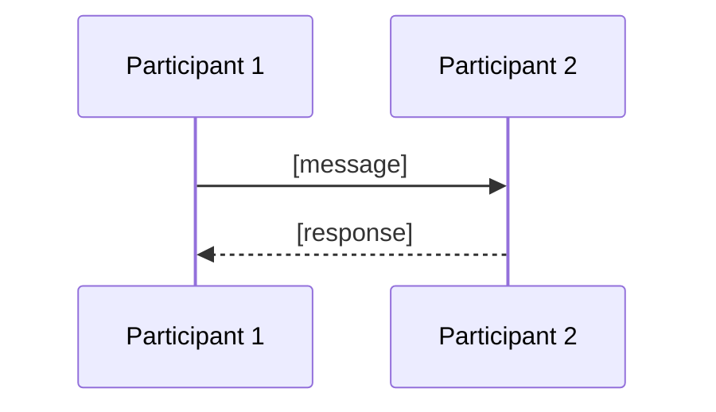

**Summary:** [1-2 sentences describing the interaction in prose.]

### 8.5.2 Sequence: [Flow Name]

<!-- Repeat for each critical sequence. -->


---


# 9. Architecture Principles

<!-- Cross-cutting principles every service in the system must honor. Add or remove rows per project. -->

| # | Principle | Description |
|---|-----------|-------------|
| AP-01 | **Stateless services** | [Description] |
| AP-02 | **Idempotency** | [Description] |
| AP-03 | **Event-Driven Architecture** | [Description] |
| AP-04 | **Domain-Driven Design** | [Description] |
| AP-05 | **Loose Coupling** | [Description] |
| AP-06 | **Tenant Isolation** | [Description] |
| AP-07 | **API-First** | [Description] |
| AP-08 | **Observability by default** | [Description] |
| AP-09 | **Secure by default** | [Description] |
| AP-10 | **Backward-compatible evolution** | [Description] |
| AP-11 | **Automated testing & CI/CD** | [Description] |
| AP-12 | **Cost-aware design** | [Description] |

---

# 10. Architectural Decisions

<!--
High-level table of architectural decisions. Each row is the at-a-glance summary of an ADR.
For deeper, individual ADRs, link to a separate ADR repository / folder.
-->

| ID | Status | Decision (What) | Why | How (Implementation) | Consequences | Alternatives & Trade-offs |
|----|--------|-----------------|-----|----------------------|--------------|---------------------------|
| AD-01 | [Proposed / Accepted / Superseded / Deprecated] | [Decision] | [Why] | [How] | [Consequences] | [Alternatives] |
| AD-02 | [Status] | [Decision] | [Why] | [How] | [Consequences] | [Alternatives] |
| AD-03 | [Status] | [Decision] | [Why] | [How] | [Consequences] | [Alternatives] |


---


# 11. Cross-Cutting Concerns (Summarized)

<!--
Each concern in this section is the platform-wide default. Individual services may override the default in their detailed section
(see "Services" below) and the override must be justified there.
-->

## 11.1 DB Modeling (Default)

- **Engine:** [Engine + version]
- **PK strategy:** [Strategy]
- **Auditing columns on every table:** [List]
- **Soft delete:** [Approach]
- **Migrations:** [Tool + workflow]
- **Naming:** [Convention]
- **Indexing:** [Default rules]
- **JSON columns:** [Usage rules]

## 11.2 Multi-Tenancy (Default)

- **Strategy:** [Shared schema with tenant_id / Schema-per-tenant / DB-per-tenant]
- **Tenant context:** [How resolved + propagated]
- **Isolation enforcement:** [How enforced]
- **Cross-tenant access:** [Policy]

## 11.3 Deployment (Default)

- **Packaging:** [Format]
- **Orchestration:** [Platform]
- **Strategy:** [Rolling / Blue-Green / Canary defaults]
- **Configuration:** [How config + secrets are delivered]
- **Resource model:** [Requests / limits / autoscaling defaults]
- **Promotion path:** [Dev -> SIT -> UAT -> Prod gating]

## 11.4 Observability (Default)

- **Logging:** [Format + mandatory fields]
- **Metrics:** [Tooling + RED + golden signals]
- **Tracing:** [Tooling + sampling]
- **Dashboards:** [Default dashboard expectations]
- **Alerting:** [Alerting model + on-call expectations]

## 11.5 Configuration Management (Default)

- **Source of truth:** [Where config lives]
- **Tooling:** [Tooling]
- **Hot reload:** [Yes / No, with conditions]
- **Feature flags:** [Tool + scoping]
- **Audit:** [Audit expectations]

## 11.6 Security (Default)

- **Service-to-service auth:** [mTLS / JWT / API key]
- **TLS:** [Minimum version + certificate management]
- **Secret rotation:** [Policy + cadence]
- **Vulnerability scanning:** [Tool + cadence + severity thresholds]
- **Dependency scanning:** [Tool + policy for critical CVEs]
- **CORS policy:** [Default rules]


---


# 12. Integrations

<!-- High-level table of all external integrations. One row per integrated system. -->

| Integration ID | What (System) | Purpose | How (Protocol / Mode) | When (Trigger) | Auth | Timeout | Rate Limit | Retries & Backoff | Fallback | Notes |
|----------------|---------------|---------|------------------------|----------------|------|---------|------------|--------------------|-----------| ------|
| INT-01 | [System] | [Purpose] | [Protocol] | [Trigger] | [Auth] | [Timeout] | [Rate limit] | [Retries / backoff] | [e.g., Return cached / Degrade / Queue for retry] | [Notes] |
| INT-02 | [System] | [Purpose] | [Protocol] | [Trigger] | [Auth] | [Timeout] | [Rate limit] | [Retries / backoff] | [Fallback] | [Notes] |


---


# 13. Services Decomposition (Summary)

| Service | Overview | Responsibility | Owns DB | Input | Output | Business Logic (Summary) | Integrations | Characteristics |
|---------|----------|----------------|---------|-------|--------|--------------------------|--------------|--------------------|
| [Service Name] | [One-line] | [Responsibility] | [DB name / schema] | [Inputs] | [Outputs] | [Summary] | [Integrations] | [Characteristics] |
| [Service Name] | [One-line] | [Responsibility] | [DB name / schema] | [Inputs] | [Outputs] | [Summary] | [Integrations] | [Characteristics] |


---


# 14. Centralized Event Hub (Platform Event Catalog & Payload Contracts)

> **What this chunk is.** The one place that lists **every event on the platform** with its producer, consumers, key family, payload contract, and business meaning (what / when / why), plus the hub topology that carries them. It is a derived consolidation of the per-service Event Models (each `10x` chunk § Event-Driven Architecture). Downstream LLD generation and implementers read this chunk as the single contract surface - the key goal is a smooth implementation with no producer/consumer mismatches.

---

## 14.1 Purpose & Scope

<!--
State the platform's eventing posture in one paragraph (EDA default: every cross-service state change travels as an asynchronous event; synchronous REST reserved for true request-response, capped at one hop).
Then answer four questions for the whole platform:
  1. What events exist (count + producing services)
  2. Who produces and who consumes each (reconciled both ways)
  3. What each event carries (envelope + payload contract)
  4. Why and when each fires (business moment + downstream purpose)
State what is OUT of scope: in-process domain events that never leave a service; provider webhooks (REST callbacks, not bus events); external adapter ingestion edges normalized at an anti-corruption layer before any platform event.
-->

[Eventing posture + the four questions + out-of-scope list.]

## 14.2 Hub Topology Decision

<!--
Name the chosen topology and why (e.g., one logical hub realized as one topic per domain plus shared special-purpose topics, fanning out to one queue per consumer; or a single broker cluster with topic-per-aggregate). State what makes it ONE hub (shared envelope standard, shared messaging library, shared schema registry, shared event archive, one delivery semantic).
Include the tradeoff table for the chosen vs rejected topology.
-->

**Decision:** [One-line topology decision.]

What makes it *one hub* is the shared contract surface:

- **One envelope standard** (§14.3) on every event, on every topic.
- **One messaging library / pattern:** [outbox -> relay -> broker -> inbox, per CLAUDE.md outbox mandate].
- **One schema registry:** [registry + additive-only rule, CI-enforced].
- **One event archive:** [archive destination, subscribed from day one, for replay].
- **One delivery semantic:** at-least-once delivery, exactly-once **effect** via `(consumer, event_id)` inbox dedup, per-aggregate ordering via `aggregate_version`.

| Dimension | [Chosen topology] | [Rejected topology] |
|---|---|---|
| Access control | [Note] | [Note] |
| Blast radius | [Note] | [Note] |
| Archive / replay granularity | [Note] | [Note] |
| Ownership | [Note] | [Note] |
| Cost / fan-out | [Note] | [Note] |

### 14.2.1 Async Backbone (the universal per-event mechanism)

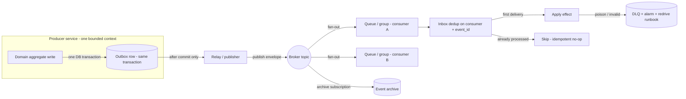

### 14.2.2 Hub Topology & Fan-Out Landscape

<!-- Producer -> topic -> consumer shape of the whole platform: structural clusters, not every edge (the full matrix is 14.5). -->

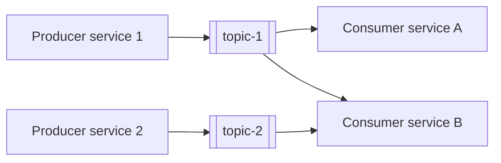

## 14.3 Standard Event Envelope (every event, every topic)

<!-- Every event carries this envelope; only the payload{} body varies per event. Adjust fields to the project but keep the invariants: unique event id (dedup key), typed past-tense fact, schema version, aggregate identity + monotonic version, UTC timestamp, correlation id, tenant keys, payload body. -->

| Field | Type | Meaning |
|---|---|---|
| `event_id` | UUIDv7 | Globally unique; the inbox dedup key `(consumer, event_id)` -> exactly-once effect. |
| `event_type` | string | SCREAMING_SNAKE_CASE, past-tense fact (e.g., `PAYMENT_COMPLETED`). |
| `schema_version` | semver | Schema version from the registry (additive-only). |
| `aggregate_id` | UUIDv7 | The producing aggregate instance. |
| `aggregate_type` | string | The producing aggregate (e.g., `Invoice`). |
| `aggregate_version` | int | Per-aggregate monotonic counter; the ordering / last-writer-wins guard. |
| `occurred_at` | timestamp (UTC) | When the fact happened. |
| `correlation_id` | UUIDv7 | Opaque request/trace correlation; carries no tenant data or PII. |
| `causation_id` | UUIDv7 (optional) | The event that caused this one. |
| `tenant_id` | UUIDv7 | Tenant key. [Adjust to the project's tenancy keys.] |
| `payload{}` | JSON | Event-specific body; schema owned by the registry (§14.9). |

**Key-family variants (if applicable):**

- [Family 1, e.g., tenant-keyed - most domain events.]
- [Family 2, e.g., generic keys for reusable services, mapped at an anti-corruption layer.]
- [Exceptions, each named and justified.]

## 14.4 Topic Registry

<!-- One row per topic. Every topic has exactly ONE owner (sole publisher). Names here are canonical - per-service chunks must use them verbatim. -->

| # | Topic | Owner (sole publisher) | Key family | Phase |
|---|---|---|---|---|
| 1 | `[project]-[domain]-events` | [Service] | [Key family] | [P1] |
| 2 | `[project]-[domain]-events` | [Service] | [Key family] | [P1] |

**No topic, no published events (consumers only):** [List consumer-only services, e.g., API Gateway, Analytics.]

## 14.5 Platform Event Catalog

<!--
Grouped by producing service / topic - one sub-section per producer, in §13 decomposition order.
Status legend: committed = wired in its phase; candidate = name fixed, no consumer wired until the contract ratifies; Analytics-only = no named domain consumer.
Consumer reconciliation: consumer lists are reconciled from BOTH the producer's published table AND every consumer's consumed table. Where a producer under-lists, show the broader real set and footnote it.
-->

**Status legend:** `committed` / `candidate` / `Analytics-only` / `Pn` = phase.

### 14.5.1 [Producer Service] — `[topic-name]` ([key family]; [phase])

| Event | Consumers | Payload (beyond envelope) | Business: what · when · why | Status |
|---|---|---|---|---|
| `[EVENT_NAME]` | [Consumer services] | `[fields beyond the envelope]` | [What fact] · [when it fires] · [why downstream cares] | [committed] |
| `[EVENT_NAME]` | [Consumer services] | `[fields]` | [what · when · why] | [candidate] |

### 14.5.2 [Producer Service] — `[topic-name]` ([key family]; [phase])

| Event | Consumers | Payload (beyond envelope) | Business: what · when · why | Status |
|---|---|---|---|---|
| `[EVENT_NAME]` | [Consumer services] | `[fields]` | [what · when · why] | [Status] |

<!-- Repeat 14.5.X per producing service. -->

## 14.6 Cross-Cutting Event Guarantees

<!-- The invariants every edge inherits. Keep as a numbered list, e.g.: -->

1. **Atomicity:** domain state + outbox row commit in one transaction; the relay publishes only after commit (no dual-writes).
2. **Delivery:** at-least-once everywhere; consumers dedup on `(consumer, event_id)`.
3. **Ordering:** per-aggregate via `aggregate_version` (last-writer-wins for projections; validated transitions for state machines) — not broker ordering.
4. **Poison handling:** invalid transitions and undeserializable messages dead-letter with alarm + redrive runbook; never silently dropped.
5. **Schema evolution:** additive-only, registry-enforced; breaking change = new event name.
6. **Replay:** archive -> consumer queue, never archive -> topic.
7. [Project-specific guarantee.]

## 14.7 Universal Subscribers & Cross-Service Doctrines

<!--
Name the broad consumers (e.g., Analytics binds every domain topic; Notification binds the wired delivery set) and any platform doctrines, e.g.:
- Re-publication doctrine: a reusable service's generic fact is consumed ONLY by the initiating service, which re-publishes its own domain fact.
- Shared special-purpose topics and their sole consumers.
-->

- [Universal subscriber 1 + breadth rule.]
- [Universal subscriber 2 + breadth rule.]
- [Doctrine 1, e.g., money-fact re-publication: initiator-only consumption + domain re-publication.]

## 14.8 Consistency Notes & Open Flags

<!--
The reconciliation ledger for producer/consumer consistency. Every divergence found while consolidating the per-service Event Models lands here with a pointer - never silently reconciled. Empty section = full reconciliation achieved; state that explicitly.
-->

| # | Where (chunks) | Divergence | Resolution / flag |
|---|---|---|---|
| 1 | [10x vs this chunk] | [e.g., consumer under-listed / payload field mismatch / topic name drift] | [Fixed in 10x on YYYY-MM-DD / flagged as OI-NN] |

## 14.9 Payload Contract Samples

<!--
Per-event payload contracts in the style of a schema-registry draft. Rules:
  - The envelope (§14.3) is NOT repeated per event - only payload{} fields beyond the envelope.
  - Type vocabulary: uuid, string, int, decimal(p,s), bool, timestamp (UTC ISO-8601), enum{...}, ref(ValueObject), array<T>, map<K,V>.
  - Required column: R = required, O = optional, C = conditional (state the condition in Notes).
  - Status mirrors §14.5.
  - PII fields are tagged `pii` and must appear in the erasure-path mapping.
Define common value objects once, then reference them.
-->

### 14.9.0 Common Value Objects

| Value object | Fields | Used by |
|---|---|---|
| `Money` | `amount decimal(19,4)`, `currency string(ISO-4217)` | [events] |
| `[ValueObject]` | [fields] | [events] |

### 14.9.1 `[EVENT_NAME]` — [status]

**Producer:** [service] · **Topic:** `[topic-name]` · **Key family:** [family]

| Field | Type | Required | Notes |
|---|---|---|---|
| `[field]` | [type] | R | [meaning; `pii` tag if applicable] |
| `[field]` | [type] | O | [meaning] |

<!-- Repeat 14.9.X per event. For large platforms, sample the load-bearing events here and keep the full set in the schema registry; state explicitly which events are registry-only (no silent gaps). -->

### 14.9.99 Coverage Matrix

<!-- One row per event in §14.5: does it have a payload contract here or in the registry? This is the single source of the platform event count. -->

| Event | Catalog (§14.5) | Contract (§14.9 / registry) | Status |
|---|---|---|---|
| `[EVENT_NAME]` | ✓ | [§14.9.1 / registry-only] | [committed] |


---


# 15. Detailed Service Specs

<!--
Repeat the service spec block below for each service (15.1, 15.2, ...).
Each service follows the exact same structure for predictability and grep-ability.
-->

---

## 15.1 [Service Name]

### What

<!-- Concise definition of the service and its bounded context. -->

[Definition.]

### Boundaries

- **Owns:** [Entities / aggregates / data this service is the source of truth for]
- **Does not own:** [Things explicitly outside its boundary]
- **Upstream consumers:** [Who calls this service]
- **Downstream dependencies:** [What this service calls / consumes]

### Input

| Type | Source | Description |
|------|--------|-------------|
| [REST / Event / Schedule / Other] | [Source] | [Description] |

### Business Logic

<!-- Plain-language description of the logic, including state machines for stateful services. -->

[Description of the core logic.]

**State machine (if applicable):**

```text
States: [State A] -> [State B] -> [State C]

Transitions and triggers:
  [State A]   --[Trigger]--> [State B]
  [State B]   --[Trigger]--> [State C]
```

### Output

| Type | Destination | Description |
|------|-------------|-------------|
| [REST response / Event / File / Other] | [Destination] | [Description] |

### Integrations

| Integration | Direction | Protocol | Purpose | Failure Handling |
|-------------|-----------|----------|---------|------------------|
| [System] | [Inbound / Outbound / Sync / Async] | [Protocol] | [Purpose] | [Failure handling] |

### DB Modeling

#### Entity Relationship

<!-- Inline Mermaid is the default diagram medium. Append an optional `> Miro: <url>` line below the block only if a richer whiteboard version exists on a real board. -->

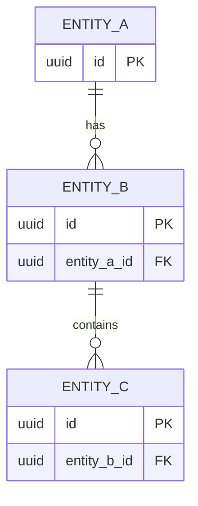

#### Tables Design

| Table | Column | Type | Constraints | Notes |
|-------|--------|------|-------------|-------|
| `[table_name]` | `[column]` | [Type] | [Constraints] | [Notes] |
| `[table_name]` | `[column]` | [Type] | [Constraints] | [Notes] |

#### Migration Strategy

- **Tool:** [Flyway / Liquibase]
- **Backward compatibility:** [Approach, e.g., additive-only changes, expand-contract for breaking changes]
- **Data backfill:** [Approach for populating new columns on existing rows]
- **Rollback:** [How to roll back a failed migration]

#### Retention Policy

- `[table_name]`: [Retention rule]
- `[table_name]`: [Retention rule]

#### Archival

- **Cold storage:** [Destination]
- **Format:** [Format]
- **Schedule:** [Schedule]
- **Restore SLA:** [SLA]

#### Data Encryption

- **At rest:** [Approach]
- **In transit:** [Approach]
- **Key management:** [KMS / Vault, rotation policy]
- **PII columns:** [List + masking policy in non-prod]

### Multi-Tenancy Specifications

<!-- Override defaults from section 11.2 only if necessary. -->

- **Strategy override:** [None / specify]
- **Tenant filter:** [How filtered]
- **Cross-tenant queries:** [Policy]

### API Standards

- **Style:** [REST / gRPC / GraphQL]
- **Versioning:** [Approach]
- **Authentication:** [Mechanism]
- **Idempotency:** [Approach]
- **Pagination:** [Approach]
- **Error envelope:** [Schema]

#### List of APIs (Swagger-friendly)

| Method | Path | Summary | Request Body | Response | Auth Scope |
|--------|------|---------|--------------|----------|------------|
| [METHOD] | `[path]` | [Summary] | `[RequestSchema]` | `[ResponseSchema]` | `[scope]` |

### Event-Driven Architecture (If Applicable)

<!--
CONSISTENCY RULE (chunk 10 is the contract registry): every topic name, event name, and payload field in this sub-section MUST match §14 (chunk 10, Centralized Event Hub) character-for-character. List BOTH published AND consumed events - consumer lists in chunk 10 are reconciled from both sides. A divergence is flagged in chunk 10 §14.8, never silently reconciled.
-->

#### Event Model

**Published events:**

| Event Name | Producer | Producer Specs | Consumers | Consumer Specs | Schema (Summary) | Delivery Guarantee |
|------------|----------|----------------|-----------|----------------|------------------|---------------------|
| `[EVENT_NAME]` | [This service] | [Topic (verbatim from §14.4), partitions, retention, key] | [Consumer services] | [Consumer group, idempotency] | `[Payload summary - fields per §14.9]` | [At-least-once / Exactly-once effect] |

**Consumed events:**

| Event Name | Producer (owning service) | Topic | Effect in this service | Idempotency / ordering |
|------------|---------------------------|-------|------------------------|------------------------|
| `[EVENT_NAME]` | [Producer service] | `[topic - verbatim from §14.4]` | [Projection update / state transition / trigger] | [Inbox dedup key, aggregate_version handling] |

#### Messaging Infra

- **Broker:** [Broker]
- **Schema registry:** [Registry / approach]
- **Serialization:** [Avro / JSON / Protobuf]
- **Topic strategy:** [Naming + partitioning]
- **Retention:** [Retention]
- **DLQ strategy:** [DLQ + replay]

### Constraints

- [Constraint 1]
- [Constraint 2]
- [Constraint 3]

### Error Handling

- **Synchronous APIs:** [Approach]
- **Validation errors:** [Approach]
- **Domain errors:** [Approach]
- **Auth errors:** [Approach]
- **Server errors:** [Approach]
- **Async consumers:** [Approach]
- **Poison messages:** [Approach]

### Observability & Monitoring

#### Logging

- [Format]
- [Mandatory fields]
- [Retention]

#### Metrics

| Metric | Type | Labels | Purpose |
|--------|------|--------|---------|
| `[metric_name]` | [counter / gauge / histogram] | [labels] | [purpose] |

#### Tracing

- [Instrumentation approach]
- [Context propagation]
- [Sampling]

### Developer Notes

- **Recommended patterns:** [Patterns]
- **Avoid:** [Anti-patterns]
- **Testing:** [Test strategy]

### Service-Level Diagrams

#### Implementation Flow Chart

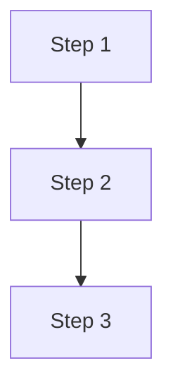

**Summary:** [1-2 sentence prose fallback so the flow is understandable without rendering the diagram.]

#### Sequence Diagram (Service-Internal)

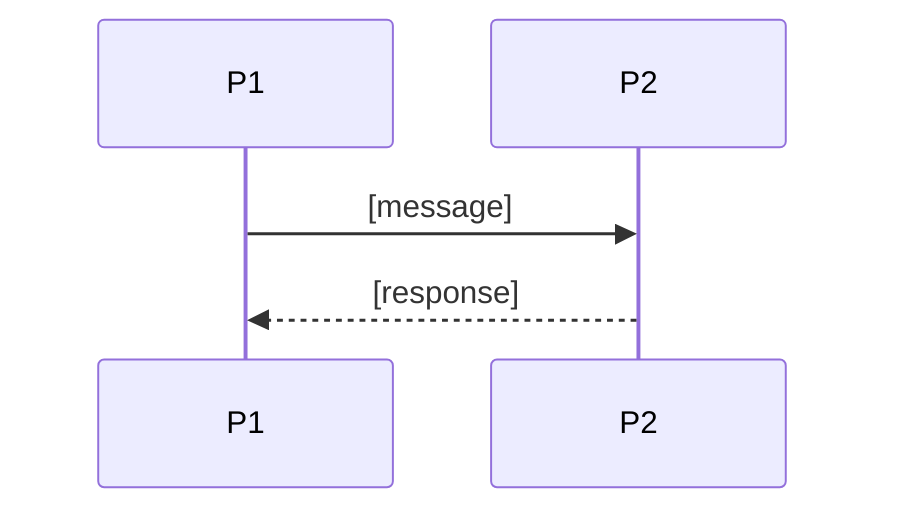

**Summary:** [1-2 sentence prose fallback describing the interaction.]

### Compliance

- **GDPR:** [Lawful basis, retention windows, right-to-erasure flow]
- **PCI-DSS:** [Applicability + approach]
- **ISO 27001 / SOC 2:** [Controls applicable]
- **Local regulations:** [List + how met]

### Deployment Strategy

- **Service-specific override:** [None / specify]
- **Replicas:** [min / max]
- **Strategy:** [Rolling / Blue-Green / Canary]
- **Health checks:** [Probes]
- **Rollback:** [Trigger + approach]

### Future Enhancements

- [Known gap or planned improvement 1]
- [Known gap or planned improvement 2]


---


# 16. Centralized User Roles & Authorities (Platform-Wide)

> **What this chunk is.** The one place that answers: what user types exist, which roles and sub-roles they break into, what each role is allowed to do, who may create or invite whom, and which services each role interacts with. Downstream, the LLD and the identity/authorization implementation seed from this catalogue - the key goal is that authorization behaves identically across every service.

---

## 16.1 Business Overview

<!-- 1-2 paragraphs in plain language: the tiers of users on the platform, the tenancy planes they live in (e.g., platform operator vs tenant company vs end customer), and the business rationale for the split. -->

[Business overview.]

## 16.2 Resolution Model — How a Role Becomes an Allowed Action

<!-- Describe the runtime path from identity to permitted action: token claims -> role/sub-role resolution -> permission lookup -> contextual gates (tenant scope, ownership, module enablement, subscription status). Name where each gate is enforced (edge gateway, authorization service, service-local check). -->

[Resolution model: identity -> role -> permission -> contextual gates, with enforcement points.]

## 16.3 User Types (Tier 1)

| User type | Tenancy plane | Identity source | Description |
|---|---|---|---|
| `[USER_TYPE]` | [Platform / Tenant / End-customer] | [IAM realm / pool] | [Description] |
| `[USER_TYPE]` | [Plane] | [Source] | [Description] |

## 16.4 Role Catalogue — Authorities & Related Services

<!-- One sub-section per Tier-1 user type. Each table: role, scope, core authorities (verbs), related services. -->

### 16.4.1 [User type A] Roles

| Role | Scope | Core authorities | Related services |
|---|---|---|---|
| `[ROLE]` | [company / compound / unit / global] | [What it may do, verb-level] | [Services touched] |

### 16.4.2 [User type B] Sub-Roles

| Sub-role | Scope | Core authorities | Related services |
|---|---|---|---|
| `[SUB_ROLE]` | [Scope] | [Authorities] | [Services] |

### 16.4.3 Platform Plane (operator — outside tenant tenancy)

| Role | Scope | Core authorities | Related services |
|---|---|---|---|
| `[PLATFORM_ROLE]` | global | [Break-glass, provisioning, billing ops, support] | [Services] |

## 16.5 Capability Matrix (canonical)

<!-- The compact capability view: capabilities as rows, roles/sub-roles as columns, Yes / - / footnoted-conditional cells. Conditional footnotes become explicit attribute-based rules (own records only, own unit only, etc.). -->

| Capability | `[ROLE_1]` | `[ROLE_2]` | `[SUB_ROLE_1]` |
|---|---|---|---|
| [Capability] | Yes | - | Yes¹ |

¹ [Condition, e.g., own unit only.]

## 16.6 Grant / Invitation Authority (who can create whom)

| Grantor role | May create / invite | Constraints |
|---|---|---|
| `[ROLE]` | `[ROLE(S)]` | [Scope limits, approval gates, count limits] |

## 16.7 Role → Related-Services Matrix (platform-wide)

<!-- Roles as rows, services as columns; cell = the interaction class (admin / write / read / none). Service names must match §13 decomposition verbatim. -->

| Role | [Service 1] | [Service 2] | [Service 3] |
|---|---|---|---|
| `[ROLE]` | [admin / write / read / -] | [—] | [—] |

## 16.8 Lifecycle, Scope & Revocation Rules

<!-- Numbered rules: how roles are granted at onboarding, how they change, what suspends or revokes them, what happens to in-flight work on revocation, and the erasure path. -->

1. [Grant rule.]
2. [Change rule.]
3. [Suspension / revocation rule + effect on in-flight work.]
4. [Erasure rule.]

## 16.9 Diagrams

### 16.9.1 Role Taxonomy (user types → roles → sub-roles)

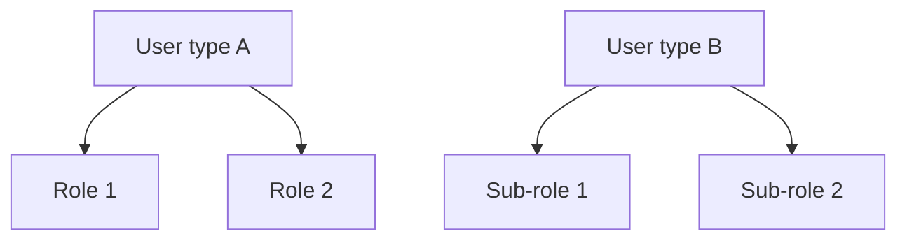

### 16.9.2 Grant / Invitation Authority (who may create whom)

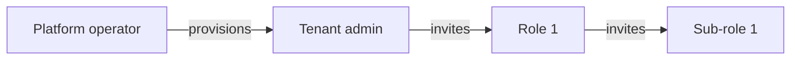

### 16.9.3 Per-Request Authorization (how a role yields a decision)

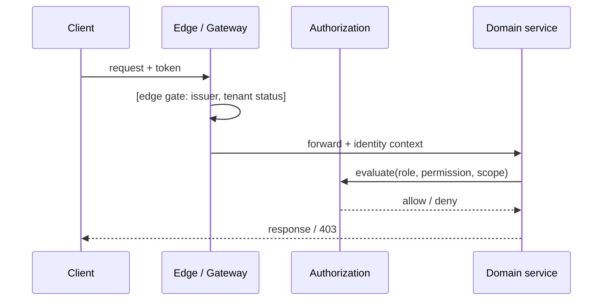

## 16.10 Traceability

<!-- Map back to the sources: BRD Users & Use Cases Matrix rows, per-service authorization notes (10x chunks), and ADRs that shaped the model. Every capability row must trace to at least one BRD UC or an ADR. -->

| Capability / rule | Source (BRD UC / matrix row / ADR / 10x chunk) |
|---|---|
| [Capability] | [Source ref] |

## 16.11 Permission × Role Matrix (platform-wide)

<!-- The exhaustive grid: one row per permission token (the runtime names services check), one column per role/sub-role. This is the implementation-facing view; §16.5 is the business-facing view. Keep tokens in the exact runtime spelling. -->

| Permission token | `[ROLE_1]` | `[ROLE_2]` | `[SUB_ROLE_1]` |
|---|---|---|---|
| `[service].[resource].[action]` | ✓ | - | ✓¹ |

## 16.12 Implementation Seed & Reconciliation

<!-- How this catalogue becomes data: the seed rows for the role/permission store, per-role action counts as a drift baseline, the canonical name-map from grid labels to runtime tokens, and a drift register for divergences found between this chunk, the BRD matrix, and per-service chunks. -->

### 16.12.1 Seed Strategy

[Where the seed lives (migration / fixture), and the update rule when roles change.]

### 16.12.2 Per-Role Action Counts (drift baseline)

| Role | Seeded permission count |
|---|---|
| `[ROLE]` | [N] |

### 16.12.3 Drift & Reconciliation Register

| # | Where | Divergence | Resolution / flag |
|---|---|---|---|
| 1 | [BRD matrix vs 10x vs this chunk] | [Mismatch] | [Fixed on YYYY-MM-DD / flagged as OI-NN] |


---


# 17. Performance & Capacity Planning

## 17.1 Load Estimates

| Dimension | Year 1 | Year 2 | Year 3 | Notes |
|-----------|--------|--------|--------|-------|
| [Dimension] | [N] | [N] | [N] | [Assumptions] |
| [Dimension] | [N] | [N] | [N] | [Assumptions] |

## 17.2 Throughput Targets (per service)

| Service | Sustained RPS | Peak RPS | p50 latency | p95 latency | p99 latency |
|---------|----------------|----------|-------------|-------------|-------------|
| [Service Name] | [N] | [N] | [Xms] | [Xms] | [Xms] |
| [Service Name] | [N] | [N] | [Xms] | [Xms] | [Xms] |

## 17.3 Peak Scenarios

| Scenario | Trigger | Expected Multiplier on Baseline | Mitigation |
|----------|---------|---------------------------------|------------|
| [Scenario] | [Trigger] | [Multiplier + duration] | [Mitigation] |
| [Scenario] | [Trigger] | [Multiplier + duration] | [Mitigation] |

## 17.4 Stress Testing Strategy

- **Tooling:** [Tool]
- **Environments:** [Where stress runs are executed]
- **Scenarios:** [Baseline / peak / spike / soak / failure injection]
- **Acceptance criteria:** [Criteria]
- **Cadence:** [Cadence]
- **Reporting:** [Where results live]


---


# 18. Environments

| Environment | Purpose | Data | Access | Promotion Source |
|-------------|---------|------|--------|------------------|
| **Dev** | [Purpose] | [Data] | [Access] | [Source] |
| **SIT** | [Purpose] | [Data] | [Access] | [Source] |
| **UAT** | [Purpose] | [Data] | [Access] | [Source] |
| **Prod** | [Purpose] | [Data] | [Access] | [Source] |

**Per-environment specifics (capture per service if they differ):**

- **Sizing:** [Per-environment sizing rules]
- **Data refresh:** [Refresh policy]
- **Feature flags:** [Per-environment defaults]
- **DNS:** [Naming convention]
- **Access controls:** [Auth + elevation rules]
- **Secrets strategy:** [e.g., Dev uses local .env / SIT+UAT use Sealed Secrets / Prod uses Vault with auto-rotation]


---


# 19. Operations Runbook

<!-- Living document. Each procedure should be runnable by an on-call engineer who did not write the service. -->

## 19.1 Common Operations

### 19.1.1 Restart a Service

```text
1. [Step]
2. [Step]
3. [Step]
4. [Step]
5. [Step]
```

### 19.1.2 Clear Cache

```text
1. [Step]
2. [Step]
3. [Step]
4. [Step]
```

### 19.1.3 Replay DLQ Messages

```text
1. [Step]
2. [Step]
3. [Step]
4. [Step]
5. [Step]
```

### 19.1.4 Rotate Secrets

```text
1. [Step]
2. [Step]
3. [Step]
4. [Step]
5. [Step]
```

### 19.1.5 Database Failover

```text
1. [Step]
2. [Step]
3. [Step]
4. [Step]
5. [Step]
6. [Step]
```

### 19.1.6 Tenant-Specific Incident Response

```text
1. [Step]
2. [Step]
3. [Step]
4. [Step]
5. [Step]
```

### 19.1.X [Add additional common operations as needed]

## 19.2 Diagnostics Cheatsheet

| Severity | Symptom | First Check | Likely Cause | Action |
|----------|---------|-------------|--------------|--------|
| [SEV1 / SEV2 / SEV3] | [Symptom] | [Where to look first] | [Likely cause] | [Action] |
| [Severity] | [Symptom] | [Where to look first] | [Likely cause] | [Action] |

## 19.3 On-Call

- **Rotation:** [Rotation policy]
- **Escalation:** [Escalation path]
- **Paging policy:** [SEV1 / SEV2 / SEV3 rules]
- **Post-incident:** [RCA expectations and timelines]


---


# 20. Appendix

| File / Reference | Description | Link |
|------------------|-------------|------|
| BRD-HLD | [Description] | [Link] |
| OpenAPI Specs | [Description] | [Link / repo path] |
| Event Schemas | [Description] | [Link / repo path] |
| ADR Repository | [Description] | [Link] |
| Threat Model | [Description] | [Link] |
| Capacity Plan | [Description] | [Link] |
| Runbooks | [Description] | [Link] |
| Diagrams Source | [Description] | [Link] |

---

# 21. Wishlist

*Future architectural enhancements (beyond per-service "Future Enhancements")*

1. [Platform-level enhancement 1]
2. [Platform-level enhancement 2]
3. [Platform-level enhancement 3]


---


# 22. End-to-End System Design (Services · Topics · Producers · Consumers)

> **What this section is.** The bird's-eye, implementation-facing map of the entire platform: the service landscape, the system context, the layered architecture, the full producer → topic → consumer fan-out, the synchronous edges, and the key sagas. A new engineer (or AI implementer) reads this section to understand how the system fits together, following its references into §14/§15/§16 for the normative contracts. One fact, one home: content owned by §14 (mechanism, registry, guarantees, doctrines) is referenced here, never restated.

---

## How to Read This Document

<!-- One short paragraph: reading order of the sections, and what each diagram notation means. -->

[Reading guidance.]

### Counts at a Glance

| Dimension | Count | Source of truth |
|---|---|---|
| Services | [N] | §13 (chunk 09) |
| Topics | [N] | §14.4 (chunk 10) |
| Distinct published events | [N] | §14.9 coverage matrix (chunk 10) |
| Synchronous REST edges | [N] | §22.7 |
| Sagas documented | [N] | §22.8 |

### Faithfulness & Deliberate Simplifications (no silent caps)

<!-- List every simplification made in this chunk's diagrams (e.g., "domain producers clustered into one node in §22.2", "only the 3 load-bearing sagas drawn"). If nothing was simplified, say so. -->

- [Simplification 1 + where the full detail lives.]

## 22.1 Service Landscape (archetype × phase)

<!-- One row per service: archetype (domain / reusable-generic / edge / read-model / orchestrator), phase, key family, sync surface, async surface. Names verbatim from §13. -->

| # | Service | Archetype | Phase | Publishes to | Consumes from | Sync surface |
|---|---|---|---|---|---|---|
| 1 | [service] | [archetype] | [P1] | `[topic]` | `[topics]` | [REST APIs exposed] |

## 22.2 System Context

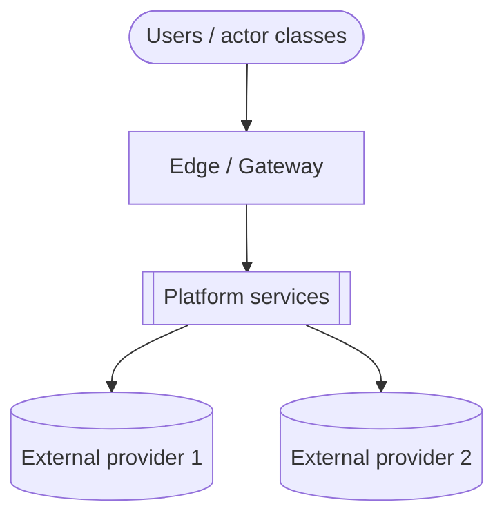

## 22.3 Layered High-Level Architecture

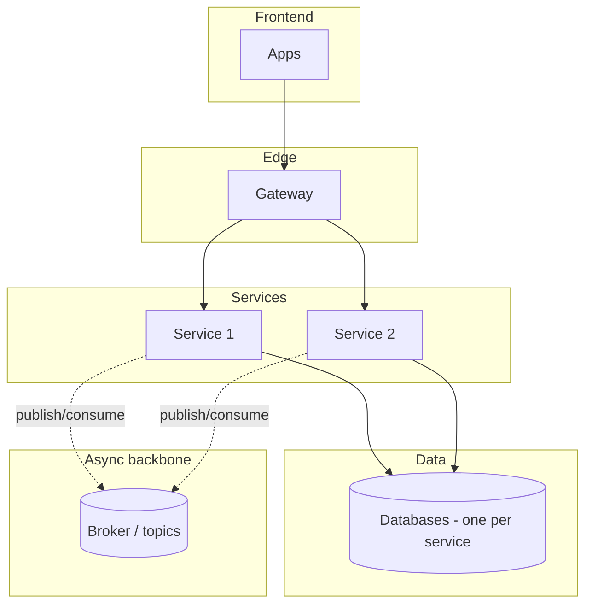

## 22.4 The Universal Per-Event Mechanism (async backbone)

<!-- Owned by §14.2.1 - referenced, never restated here. One prose sentence + the pointer. -->

Every event on every topic flows through the one universal mechanism — outbox → relay → topic → per-consumer queue with inbox dedup and DLQ. **Normative definition and diagram: §14.2.1.**

## 22.5 Producer → Topic → Consumer Fan-Out (the event map)

<!-- One sub-section per delivery phase. Each: a Mermaid flowchart of producer -> topic -> consumers for that phase's services. Edge labels name the load-bearing events. The exhaustive matrix stays in §14.5; this is the navigable visual. -->

### 22.5.1 Phase 1 Core

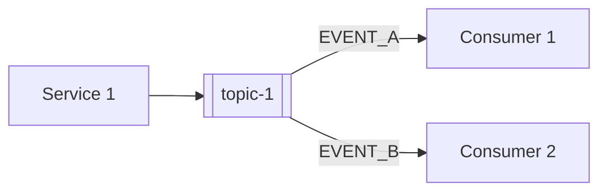

### 22.5.2 Phase 2+ Domains

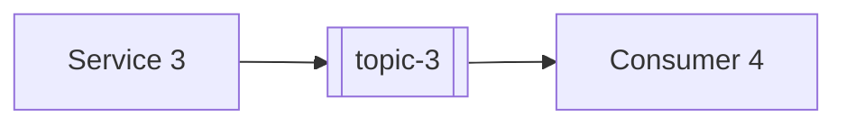

### 22.5.3 Universal Subscribers (breadth rules)

<!-- Name the broad consumers only (they would clutter every fan-out diagram above); their binding rules are owned by §14.7 - reference, don't restate. -->

- [Universal subscriber — see §14.7 for its binding rule.]

## 22.6 Cross-Service Doctrines

<!-- Name each platform-wide interaction doctrine + a pointer to its normative home (§14.7 / ADR). Names only - the rules are not restated here. -->

1. [Doctrine name — normative home §14.7 / AD-NN.]

## 22.7 Synchronous REST Edges (one-hop rule)

<!-- Every service-to-service synchronous call on the platform. Per CLAUDE.md: no chained REST more than one hop deep. Each row: caller -> callee, purpose, why it must be synchronous. -->

| # | Caller → Callee | Purpose | Why synchronous |
|---|---|---|---|
| 1 | [svc] → [svc] | [Purpose] | [Justification] |

## 22.8 Key Sagas (dynamic view)

<!-- One sub-section per load-bearing cross-service flow: orchestrator (or choreography), participants, happy path, compensation path. Mermaid sequence diagrams. -->

### 22.8.1 [Saga name] ([orchestrated by X / choreographed])

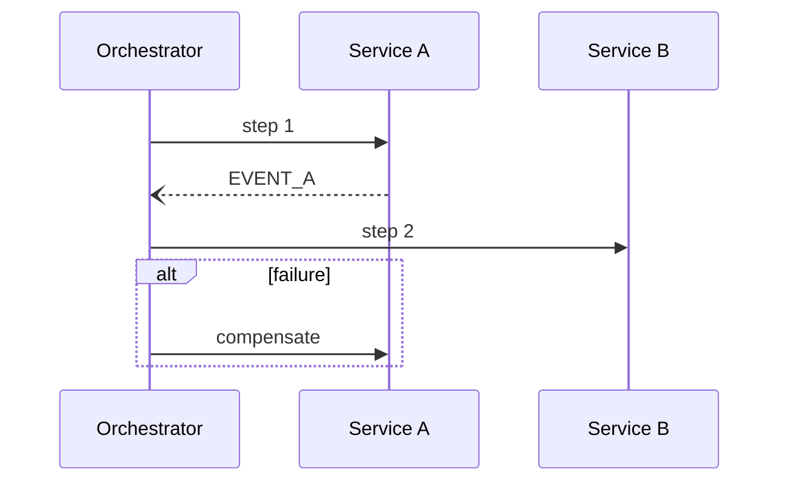

## 22.9 Normative References

<!-- Pure pointer section - no tables, no restated rules. One fact, one home. -->

- **Topic registry (one row per topic, owner, key family):** §14.4.
- **Per-event consumer reconciliation:** §14.5; payload contracts: §14.9.
- **Cross-cutting guarantees every edge inherits:** §14.6.
- **Universal subscribers & doctrines:** §14.7.
- **Roles & authorities behind every edge's authorization:** §16.

## Sources

<!-- The chunks this consolidation was built from, with a one-line note per source. -->

- Chunk 09 (§13 decomposition) · chunk 10 (§14 event hub) · chunks 10a+ (§15 service specs) · chunk 11 (§16 roles).


---


# 23. Open Items & Clarifications

> **What this section is.** A structured backlog of architectural concerns identified after the main SDD was authored, by a reviewer running with cleared context. Each item comes with a **Recommended Answer** - a concrete, ready-to-apply resolution. Items are decisions awaiting the architect's acceptance: accept the recommendation (or adjust it), and it gets reflected into the SDD body.
>
> **What this section is not.** It is not a list of inline `[NEEDS CLARIFICATION: ...]` markers found in the body - those remain inline. This section is the reviewer's *external* findings: gaps the body did not mark, scenarios the body did not consider, corner cases the body did not test for, and contract inconsistencies between the centralized catalogues (chunks 10, 11, 16) and the per-service chunks they consolidate.

---

## How to read each item

| Field | Meaning |
|-------|---------|
| **ID** | OI-NN. Stable across revisions. |
| **Where** | Section number (e.g., §6, §15.1), service name, or "global" if cross-cutting. |
| **Type** | Architecture gap / Missing scenario / Corner case / Ambiguity / Risk / Inconsistency / NFR shortfall / ADR needed / Contract mismatch (topic, event, payload, consumer list, or role/permission divergence across chunks) / Duplication (BRD content or another chunk's content restated instead of referenced). |
| **Concern** | One paragraph. What was missed and why it matters for downstream LLD or implementation. |
| **Options** | At least 2 concrete choices, each with a one-line tradeoff. |
| **Recommended Answer** | The reviewer's concrete proposed resolution, written as ready-to-apply SDD content (the exact row, decision, sub-section, or wording that would close the item). This is what gets injected into the body when accepted. |
| **Why** | REQUIRED. One or two lines: the reason the recommended option wins over the alternatives — the evidence behind it (BRD requirement, NFR, doctrine/CLAUDE.md default, operational risk avoided) and the tradeoff being accepted. Never empty, never "best option". |
| **Status** | Open (awaiting decision) / Accepted - applied (with pointer) / Adjusted - applied / Deferred (with rationale) / Rejected. |

---

## Open Items

### OI-01: [Short title]

- **Where:** [§N or service name or "global"]
- **Type:** [Architecture gap | Missing scenario | Corner case | Ambiguity | Risk | Inconsistency | NFR shortfall | ADR needed | Contract mismatch | Duplication]
- **Concern:** [One paragraph.]
- **Options:**
  - **A.** [Option A] — [one-line tradeoff].
  - **B.** [Option B] — [one-line tradeoff].
  - **C.** [Option C] — [one-line tradeoff]. *(Optional.)*
- **Recommended Answer:** [Option letter + the concrete resolution text, ready to paste into the SDD. E.g., "Option A - add ADR-07 to §10: 'Use the transactional outbox pattern for all state-change events; rationale: ...'"]
- **Why:** [The reason this option wins: evidence (BRD requirement, NFR, doctrine default) + the tradeoff accepted.]
- **Status:** Open

---

### OI-02: [Short title]

- **Where:** [...]
- **Type:** [...]
- **Concern:** [...]
- **Options:**
  - **A.** [...] — [...].
  - **B.** [...] — [...].
- **Recommended Answer:** [...]
- **Why:** [...]
- **Status:** Open

---

<!-- Repeat the OI block for each open item. -->

---

## Resolution Log

<!-- When an open item is accepted (or adjusted) and applied, move its summary here with a pointer to the SDD update (chunk + heading). Audit trail. -->

| ID | Resolution Date | Resolved In | Outcome |
|----|----------------|-------------|---------|
| [OI-XX] | [YYYY-MM-DD] | [Chunk and section] | [Accepted recommendation | Adjusted: short note | Deferred | Rejected] |

---

## Reviewer Notes

<!-- Optional. Free-form notes that did not crystallise into a numbered open item. -->

- [Note 1]
- [Note 2]

