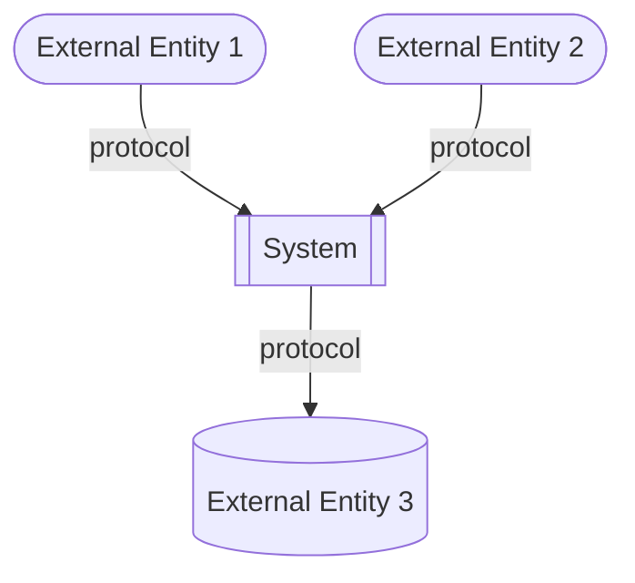
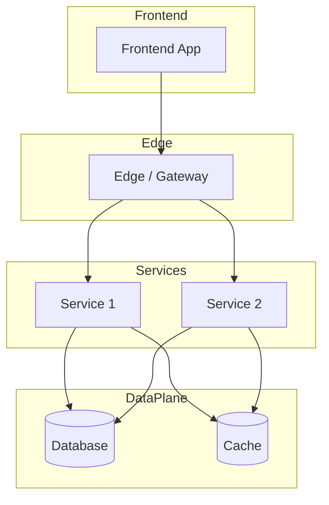
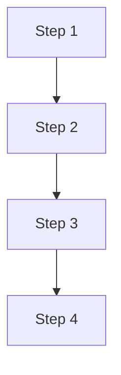
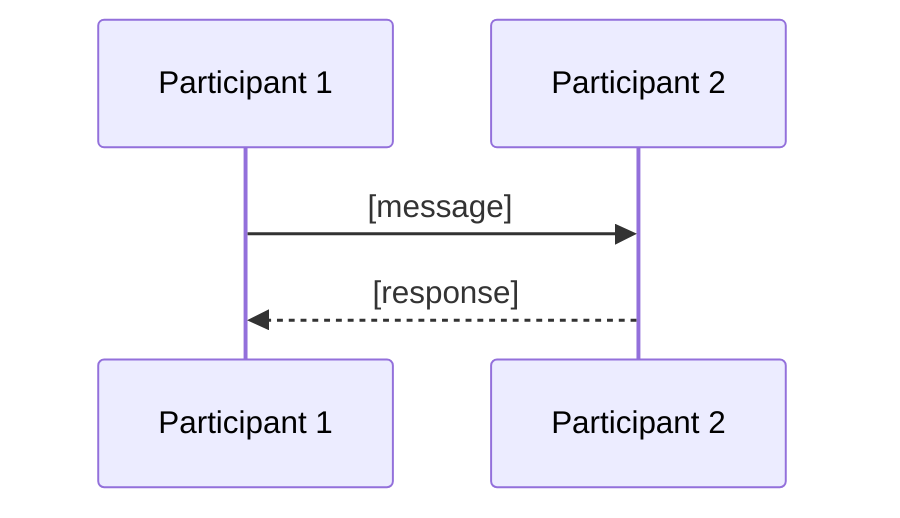
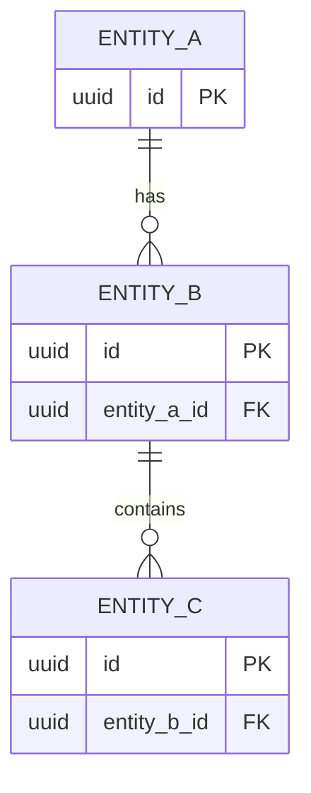
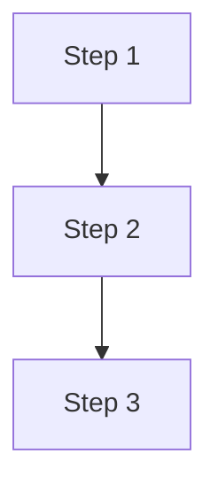
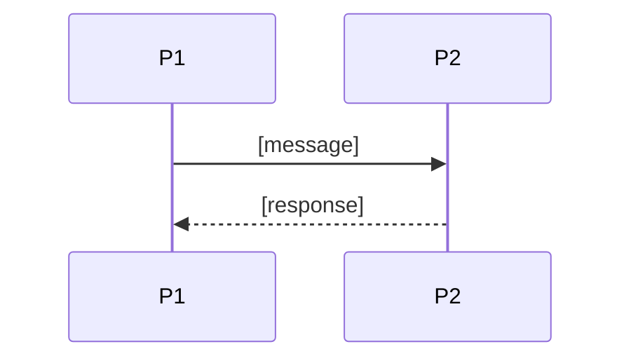

# [Project / Product Name]: Solution Design Document (SDD)

**Project / Product Name:** [Project Name]
**Version:** [X.X]
**Status:** [Draft | In Review | Approved]
**Author:** [Author Name]
**Reviewers:** [Reviewer Name(s)]
**Approvers:** [Approver Name(s)]
**Date:** [YYYY-MM-DD]
**Related BRD:** [Link / file name of the corresponding BRD-HLD]

---

## Changes Log

| Version | Updated Date | Updated By | Reviewed By | Approved By | Update Summary |
|---------|--------------|------------|-------------|-------------|----------------|
| 1.0     | YYYY-MM-DD   | [Name]     |             |             | Initial draft. |

---

## Table of Contents

<!-- Auto-generated or manually maintained. Include Figures and Tables indices if the document is large. -->

**Figures**

| Figure # | Title | Section |
|----------|-------|---------|
| Figure 1 | [Title] | [Section] |

**Tables**

| Table # | Title | Section |
|---------|-------|---------|
| Table 1 | [Title] | [Section] |

---

# 1. Executive Summary

<!--
Technical executive summary, complementary to the BRD executive summary.
Focus: what the system is technically, the architecture style at a glance, the key technology pillars, and the technical bets.
Audience: engineering leadership, architects, senior developers, SRE/DevOps.
2-4 paragraphs.
-->

[Technical description of the system.]

[Architecture style and primary technical objectives.]

Core technical capabilities at a glance:

- [Capability 1]
- [Capability 2]
- [Capability 3]

Key technical bets and trade-offs:

- [Bet 1 and rationale]
- [Bet 2 and rationale]

---

# 2. Scope

## 2.1 In Scope

<!-- Solution-design-level scope. What this SDD will detail and what the team commits to design and build. -->

- [Solution scope item 1]
- [Solution scope item 2]
- [Solution scope item 3]

## 2.2 Out of Scope

<!-- Explicitly excluded from this SDD. Reference the deferral reason or the document where it is handled. -->

- [Out-of-scope item 1, with justification or deferral note]
- [Out-of-scope item 2]

---

# 3. Assumptions

<!-- Numbered list. Each assumption should be testable and unambiguous. Anything that, if false, would invalidate the design. -->

1. **[Short Label]:** [Detailed assumption description].
2. **[Short Label]:** [Detailed assumption description].
3. **[Short Label]:** [Detailed assumption description].

---

# 4. Risks

<!--
List of technical and architectural risks. Each risk includes likelihood, impact, and a mitigation.
Owner: who will own the mitigation and the monitoring of the risk.
-->

| Risk ID | Description | Likelihood (L/M/H) | Impact (L/M/H) | Mitigation | Owner |
|---------|-------------|--------------------|----------------|------------|-------|
| R-01    | [Risk description] | [L/M/H] | [L/M/H] | [Mitigation] | [Owner] |
| R-02    | [Risk description] | [L/M/H] | [L/M/H] | [Mitigation] | [Owner] |

---

# 5. Glossary

| Term | Definition |
|------|------------|
| [Term 1] | [Definition] |
| [Term 2] | [Definition] |

---

# 6. Ecosystem Overview

<!--
Summary of the platform-wide technology stack and shared infrastructure that all services in this SDD must conform to.
This section is the single source of truth for the implementation constitution and planned technology choices.
-->

| Layer | Technology / Service | Version / Tier | Notes |
|-------|----------------------|----------------|-------|
| Compute / Infra | [On-prem Kubernetes / EKS / AKS / GKE] | [vX.Y] | [Cluster topology, node groups, multi-AZ, etc.] |
| Container Runtime | [containerd / Docker] | [vX.Y] | [Notes] |
| Service Mesh / Ingress | [Istio / Linkerd / NGINX Ingress / Cloud LB] | [vX.Y] | [mTLS, traffic policies] |
| Primary RDBMS | [PostgreSQL / other] | [Version] | [HA topology, replicas, backups] |
| Caching | [Redis / ElastiCache / other] | [Version] | [Cluster mode, persistence, eviction] |
| Event Broker / Streaming | [Kafka / SNS+SQS / RabbitMQ / ActiveMQ] | [Version] | [Topic strategy, retention, partitions] |
| Object Storage | [S3 / MinIO / Azure Blob / other] | [Tier] | [Bucket strategy, lifecycle policies] |
| IAM / AuthN | [Keycloak / Cognito / Auth0 / other] | [Version] | [Realms, federation, OIDC flows] |
| Secrets Management | [Vault / Secrets Manager / Sealed Secrets] | [Version] | [Rotation policy] |
| API Gateway | [Kong / API Gateway / Spring Cloud Gateway] | [Version] | [Auth, rate limiting, routing] |
| CI/CD | [GitHub Actions / GitLab CI / Jenkins / ArgoCD] | [Version] | [Pipeline standards] |
| Observability: Logging | [Loki / ELK / CloudWatch / other] | [Version] | [Retention, indices] |
| Observability: Metrics | [Prometheus + Grafana / Datadog / other] | [Version] | [Scrape interval, dashboards] |
| Observability: Tracing | [OpenTelemetry + Jaeger / Tempo / X-Ray] | [Version] | [Sampling rate] |
| Backend Runtime | [Language + Framework, e.g., Java 21 / Spring Boot 3.4+] | [Version] | [Layering rules] |
| Frontend Stack | [Framework + UI lib, e.g., Angular / Tailwind / PrimeNG] | [Version] | [Design system, primary color] |
| Reporting / BI | [Tool] | [Version] | [Read-replica or warehouse-backed] |

**Ecosystem-level rules:**

- [Rule 1, e.g., timezone]
- [Rule 2, e.g., ID strategy]
- [Rule 3, e.g., service-to-service auth]
- [Rule 4, e.g., secrets handling]

---

# 7. System Users & Use Cases

## 7.1 Actors

<!-- List all actors (human users and external systems) that interact with the platform. -->

| Actor | Type (Human / System) | Description | Primary Interface |
|-------|-----------------------|-------------|-------------------|
| [Actor 1] | [Human / System] | [Description] | [Interface] |
| [Actor 2] | [Human / System] | [Description] | [Interface] |

## 7.2 Use Case Diagram

**Figure 1: Use Case Diagram**

> Description (tool-agnostic; copy and paste into Miro, Lucidchart, draw.io, or any AI visualizer).

```text
Actors (left side):
  - [Actor 1]
  - [Actor 2]

Actors (right side):
  - [External System 1]
  - [External System 2]

System boundary box: "[System Name]"

Use cases inside the boundary:
  UC-01: [Use Case Name]
  UC-02: [Use Case Name]
  UC-03: [Use Case Name]

Associations:
  [Actor 1] -> [Use Case IDs]
  [Actor 2] -> [Use Case IDs]

Relationships:
  [UC-XX] <<include>> [UC-YY]
  [UC-XX] <<extend>>  [UC-YY]
```

**Mermaid alternative:**


---

# 8. System Design / High-Level Architecture

## 8.1 Architecture Style

### 8.1.1 What

<!-- Name the style. -->

[Architecture style statement.]

### 8.1.2 Why

<!-- Why this style fits the business and technical objectives. Tie back to NFRs and BRD objectives. -->

- [Reason 1]
- [Reason 2]
- [Reason 3]

### 8.1.3 How

<!-- How the style manifests in this system: bounded contexts, communication patterns, data ownership, deployment model. -->

- **Bounded contexts:** [List of contexts and which service owns each]
- **Inter-service communication:** [Sync vs async; protocols]
- **Data ownership:** [Ownership rules]
- **Deployment model:** [Packaging and orchestration]

## 8.2 Context Diagram

**Figure 2: System Context Diagram**

> Description (tool-agnostic; copy and paste into Miro, Lucidchart, draw.io).

```text
Center node (system under design):
  "[System Name]"

External actors / systems (around the center):
  - [External entity 1]
  - [External entity 2]
  - [External entity 3]

Connections (label each line with protocol + purpose):
  [Source] --[protocol]--> [Target]   ([purpose])
  [Source] --[protocol]--> [Target]   ([purpose])
```

**Mermaid alternative:**



## 8.3 High-Level Architecture Diagram

**Figure 3: High-Level Architecture**

> Description (tool-agnostic).

```text
Layers, top to bottom:

L1 Edge / Entry:
  - [Components]

L2 Frontend:
  - [Components]

L3 Backend Services:
  - [Service 1]
  - [Service 2]
  - [Service N]

L4 Data Plane:
  - [Datastores]

L5 Async Backbone:
  - [Broker / topics]

L6 External:
  - [External systems]

L7 Observability:
  - [Logs / metrics / traces stack]

Connections:
  - [Connection 1]
  - [Connection 2]
```

**Mermaid alternative:**



## 8.4 Workflow Diagrams

<!-- Add one workflow per critical end-to-end business flow. Use the same pattern: text description + optional Mermaid. -->

### 8.4.1 Workflow: [Flow Name]

> Description (tool-agnostic).

```text
Steps:
  1. [Step]
  2. [Step]
  3. [Step]
  4. [Step]
  5. [Step]
```

**Mermaid alternative:**



### 8.4.2 Workflow: [Flow Name]

<!-- Repeat for each critical workflow. -->

## 8.5 Sequence Diagrams

<!-- Add one sequence diagram per critical interaction (sync + async). -->

### 8.5.1 Sequence: [Flow Name]

> Description (tool-agnostic).

```text
Participants (left to right):
  [Participant 1], [Participant 2], [Participant 3]

Messages:
  1. [Source] -> [Target]: [message]
  2. [Source] -> [Target]: [message]
  3. [Source] -> [Target]: [message]
```

**Mermaid alternative:**



### 8.5.2 Sequence: [Flow Name]

<!-- Repeat for each critical sequence. -->

---

# 9. Architecture Principles

<!-- Cross-cutting principles every service in the system must honor. Add or remove rows per project. -->

| # | Principle | Description |
|---|-----------|-------------|
| AP-01 | **Stateless services** | [Description] |
| AP-02 | **Idempotency** | [Description] |
| AP-03 | **Event-Driven Architecture** | [Description] |
| AP-04 | **Domain-Driven Design** | [Description] |
| AP-05 | **Loose Coupling** | [Description] |
| AP-06 | **Tenant Isolation** | [Description] |
| AP-07 | **API-First** | [Description] |
| AP-08 | **Observability by default** | [Description] |
| AP-09 | **Secure by default** | [Description] |
| AP-10 | **Backward-compatible evolution** | [Description] |
| AP-11 | **Automated testing & CI/CD** | [Description] |
| AP-12 | **Cost-aware design** | [Description] |

---

# 10. Architectural Decisions

<!--
High-level table of architectural decisions. Each row is the at-a-glance summary of an ADR.
For deeper, individual ADRs, link to a separate ADR repository / folder.
-->

| ID | Status | Decision (What) | Why | How (Implementation) | Consequences | Alternatives & Trade-offs |
|----|--------|-----------------|-----|----------------------|--------------|---------------------------|
| AD-01 | [Proposed / Accepted / Superseded / Deprecated] | [Decision] | [Why] | [How] | [Consequences] | [Alternatives] |
| AD-02 | [Status] | [Decision] | [Why] | [How] | [Consequences] | [Alternatives] |
| AD-03 | [Status] | [Decision] | [Why] | [How] | [Consequences] | [Alternatives] |

---

# 11. Cross-Cutting Concerns (Summarized)

<!--
Each concern in this section is the platform-wide default. Individual services may override the default in their detailed section
(see section 13.2) and the override must be justified there.
-->

## 11.1 DB Modeling (Default)

- **Engine:** [Engine + version]
- **PK strategy:** [Strategy]
- **Auditing columns on every table:** [List]
- **Soft delete:** [Approach]
- **Migrations:** [Tool + workflow]
- **Naming:** [Convention]
- **Indexing:** [Default rules]
- **JSON columns:** [Usage rules]

## 11.2 Multi-Tenancy (Default)

- **Strategy:** [Shared schema with tenant_id / Schema-per-tenant / DB-per-tenant]
- **Tenant context:** [How resolved + propagated]
- **Isolation enforcement:** [How enforced]
- **Cross-tenant access:** [Policy]

## 11.3 Deployment (Default)

- **Packaging:** [Format]
- **Orchestration:** [Platform]
- **Strategy:** [Rolling / Blue-Green / Canary defaults]
- **Configuration:** [How config + secrets are delivered]
- **Resource model:** [Requests / limits / autoscaling defaults]
- **Promotion path:** [Dev -> SIT -> UAT -> Prod gating]

## 11.4 Observability (Default)

- **Logging:** [Format + mandatory fields]
- **Metrics:** [Tooling + RED + golden signals]
- **Tracing:** [Tooling + sampling]
- **Dashboards:** [Default dashboard expectations]
- **Alerting:** [Alerting model + on-call expectations]

## 11.5 Configuration Management (Default)

- **Source of truth:** [Where config lives]
- **Tooling:** [Tooling]
- **Hot reload:** [Yes / No, with conditions]
- **Feature flags:** [Tool + scoping]
- **Audit:** [Audit expectations]

## 11.6 Security (Default)

- **Service-to-service auth:** [mTLS / JWT / API key]
- **TLS:** [Minimum version + certificate management]
- **Secret rotation:** [Policy + cadence]
- **Vulnerability scanning:** [Tool + cadence + severity thresholds]
- **Dependency scanning:** [Tool + policy for critical CVEs]
- **CORS policy:** [Default rules]

---

# 12. Integrations

<!-- High-level table of all external integrations. One row per integrated system. -->

| Integration ID | What (System) | Purpose | How (Protocol / Mode) | When (Trigger) | Auth | Timeout | Rate Limit | Retries & Backoff | Fallback | Notes |
|----------------|---------------|---------|------------------------|----------------|------|---------|------------|--------------------|-----------| ------|
| INT-01 | [System] | [Purpose] | [Protocol] | [Trigger] | [Auth] | [Timeout] | [Rate limit] | [Retries / backoff] | [e.g., Return cached / Degrade / Queue for retry] | [Notes] |
| INT-02 | [System] | [Purpose] | [Protocol] | [Trigger] | [Auth] | [Timeout] | [Rate limit] | [Retries / backoff] | [Fallback] | [Notes] |

---

# 13. Services

## 13.1 Services Decomposition (Summary)

| Service | Overview | Responsibility | Owns DB | Input | Output | Business Logic (Summary) | Integrations | Characteristics |
|---------|----------|----------------|---------|-------|--------|--------------------------|--------------|--------------------|
| [Service Name] | [One-line] | [Responsibility] | [DB name / schema] | [Inputs] | [Outputs] | [Summary] | [Integrations] | [Characteristics] |
| [Service Name] | [One-line] | [Responsibility] | [DB name / schema] | [Inputs] | [Outputs] | [Summary] | [Integrations] | [Characteristics] |

## 13.2 Detailed Service Specs

<!--
Repeat the service spec block below for each service in the system.
Each service follows the exact same structure for predictability and grep-ability.
-->

---

### 13.2.1 [Service Name]

#### What

<!-- Concise definition of the service and its bounded context. -->

[Definition.]

#### Boundaries

- **Owns:** [Entities / aggregates / data this service is the source of truth for]
- **Does not own:** [Things explicitly outside its boundary]
- **Upstream consumers:** [Who calls this service]
- **Downstream dependencies:** [What this service calls / consumes]

#### Input

| Type | Source | Description |
|------|--------|-------------|
| [REST / Event / Schedule / Other] | [Source] | [Description] |

#### Business Logic

<!-- Plain-language description of the logic, including state machines for stateful services. -->

[Description of the core logic.]

**State machine (if applicable):**

```text
States: [State A] -> [State B] -> [State C]

Transitions and triggers:
  [State A]   --[Trigger]--> [State B]
  [State B]   --[Trigger]--> [State C]
```

#### Output

| Type | Destination | Description |
|------|-------------|-------------|
| [REST response / Event / File / Other] | [Destination] | [Description] |

#### Integrations

| Integration | Direction | Protocol | Purpose | Failure Handling |
|-------------|-----------|----------|---------|------------------|
| [System] | [Inbound / Outbound / Sync / Async] | [Protocol] | [Purpose] | [Failure handling] |

#### DB Modeling

##### Entity Relationship

> ERD description (tool-agnostic).

```text
Entities (with PKs in []):
  - [entity_a] [pk]
  - [entity_b] [pk]
  - [entity_c] [pk]

Relationships:
  [entity_a] [cardinality] [entity_b]   (FK: [entity_b].[fk_column])
  [entity_b] [cardinality] [entity_c]   (FK: [entity_c].[fk_column])
```

**Mermaid alternative:**



##### Tables Design

| Table | Column | Type | Constraints | Notes |
|-------|--------|------|-------------|-------|
| `[table_name]` | `[column]` | [Type] | [Constraints] | [Notes] |
| `[table_name]` | `[column]` | [Type] | [Constraints] | [Notes] |

##### Migration Strategy

- **Tool:** [Flyway / Liquibase]
- **Backward compatibility:** [Approach, e.g., additive-only changes, expand-contract for breaking changes]
- **Data backfill:** [Approach for populating new columns on existing rows]
- **Rollback:** [How to roll back a failed migration]

##### Retention Policy

- `[table_name]`: [Retention rule]
- `[table_name]`: [Retention rule]

##### Archival

- **Cold storage:** [Destination]
- **Format:** [Format]
- **Schedule:** [Schedule]
- **Restore SLA:** [SLA]

##### Data Encryption

- **At rest:** [Approach]
- **In transit:** [Approach]
- **Key management:** [KMS / Vault, rotation policy]
- **PII columns:** [List + masking policy in non-prod]

#### Multi-Tenancy Specifications

<!-- Override defaults from section 11.2 only if necessary. -->

- **Strategy override:** [None / specify]
- **Tenant filter:** [How filtered]
- **Cross-tenant queries:** [Policy]

#### API Standards

- **Style:** [REST / gRPC / GraphQL]
- **Versioning:** [Approach]
- **Authentication:** [Mechanism]
- **Idempotency:** [Approach]
- **Pagination:** [Approach]
- **Error envelope:** [Schema]

##### List of APIs (Swagger-friendly)

| Method | Path | Summary | Request Body | Response | Auth Scope |
|--------|------|---------|--------------|----------|------------|
| [METHOD] | `[path]` | [Summary] | `[RequestSchema]` | `[ResponseSchema]` | `[scope]` |

#### Event-Driven Architecture (If Applicable)

##### Event Model

| Event Name | Producer | Producer Specs | Consumers | Consumer Specs | Schema (Summary) | Delivery Guarantee |
|------------|----------|----------------|-----------|----------------|------------------|---------------------|
| `[EventName]` | [Service] | [Topic, partitions, retention, key] | [Consumer services] | [Consumer group, idempotency] | `[Payload summary]` | [At-least-once / Exactly-once] |

##### Messaging Infra

- **Broker:** [Broker]
- **Schema registry:** [Registry / approach]
- **Serialization:** [Avro / JSON / Protobuf]
- **Topic strategy:** [Naming + partitioning]
- **Retention:** [Retention]
- **DLQ strategy:** [DLQ + replay]

#### Constraints

- [Constraint 1]
- [Constraint 2]
- [Constraint 3]

#### Error Handling

- **Synchronous APIs:** [Approach]
- **Validation errors:** [Approach]
- **Domain errors:** [Approach]
- **Auth errors:** [Approach]
- **Server errors:** [Approach]
- **Async consumers:** [Approach]
- **Poison messages:** [Approach]

#### Observability & Monitoring

##### Logging

- [Format]
- [Mandatory fields]
- [Retention]

##### Metrics

| Metric | Type | Labels | Purpose |
|--------|------|--------|---------|
| `[metric_name]` | [counter / gauge / histogram] | [labels] | [purpose] |

##### Tracing

- [Instrumentation approach]
- [Context propagation]
- [Sampling]

#### Developer Notes

- **Recommended patterns:** [Patterns]
- **Avoid:** [Anti-patterns]
- **Testing:** [Test strategy]

#### Service-Level Diagrams

##### Implementation Flow Chart

> Description (tool-agnostic).

```text
Inputs:
  - [Input 1]
  - [Input 2]

Flow:
  1. [Step]
  2. [Step]
  3. [Step]
  4. [Step]
```

**Mermaid alternative:**



##### Sequence Diagram (Service-Internal)

> Description (tool-agnostic).

```text
Participants: [P1], [P2], [P3]

  1. [P1] -> [P2]: [message]
  2. [P2] -> [P3]: [message]
  3. [P3] -> [P2]: [response]
  4. [P2] -> [P1]: [response]
```

**Mermaid alternative:**



#### Compliance

- **GDPR:** [Lawful basis, retention windows, right-to-erasure flow]
- **PCI-DSS:** [Applicability + approach]
- **ISO 27001 / SOC 2:** [Controls applicable]
- **Local regulations:** [List + how met]

#### Deployment Strategy

- **Service-specific override:** [None / specify]
- **Replicas:** [min / max]
- **Strategy:** [Rolling / Blue-Green / Canary]
- **Health checks:** [Probes]
- **Rollback:** [Trigger + approach]

#### Future Enhancements

- [Known gap or planned improvement 1]
- [Known gap or planned improvement 2]

<!-- Repeat the entire service spec block (13.2.X) for each additional service -->

---

# 14. Performance & Capacity Planning

## 14.1 Load Estimates

| Dimension | Year 1 | Year 2 | Year 3 | Notes |
|-----------|--------|--------|--------|-------|
| [Dimension] | [N] | [N] | [N] | [Assumptions] |
| [Dimension] | [N] | [N] | [N] | [Assumptions] |

## 14.2 Throughput Targets (per service)

| Service | Sustained RPS | Peak RPS | p50 latency | p95 latency | p99 latency |
|---------|----------------|----------|-------------|-------------|-------------|
| [Service Name] | [N] | [N] | [Xms] | [Xms] | [Xms] |
| [Service Name] | [N] | [N] | [Xms] | [Xms] | [Xms] |

## 14.3 Peak Scenarios

| Scenario | Trigger | Expected Multiplier on Baseline | Mitigation |
|----------|---------|---------------------------------|------------|
| [Scenario] | [Trigger] | [Multiplier + duration] | [Mitigation] |
| [Scenario] | [Trigger] | [Multiplier + duration] | [Mitigation] |

## 14.4 Stress Testing Strategy

- **Tooling:** [Tool]
- **Environments:** [Where stress runs are executed]
- **Scenarios:** [Baseline / peak / spike / soak / failure injection]
- **Acceptance criteria:** [Criteria]
- **Cadence:** [Cadence]
- **Reporting:** [Where results live]

---

# 15. Environments

| Environment | Purpose | Data | Access | Promotion Source |
|-------------|---------|------|--------|------------------|
| **Dev** | [Purpose] | [Data] | [Access] | [Source] |
| **SIT** | [Purpose] | [Data] | [Access] | [Source] |
| **UAT** | [Purpose] | [Data] | [Access] | [Source] |
| **Prod** | [Purpose] | [Data] | [Access] | [Source] |

**Per-environment specifics (capture per service if they differ):**

- **Sizing:** [Per-environment sizing rules]
- **Data refresh:** [Refresh policy]
- **Feature flags:** [Per-environment defaults]
- **DNS:** [Naming convention]
- **Access controls:** [Auth + elevation rules]
- **Secrets strategy:** [e.g., Dev uses local .env / SIT+UAT use Sealed Secrets / Prod uses Vault with auto-rotation]

---

# 16. Operations Runbook

<!-- Living document. Each procedure should be runnable by an on-call engineer who did not write the service. -->

## 16.1 Common Operations

### 16.1.1 Restart a Service

```text
1. [Step]
2. [Step]
3. [Step]
4. [Step]
5. [Step]
```

### 16.1.2 Clear Cache

```text
1. [Step]
2. [Step]
3. [Step]
4. [Step]
```

### 16.1.3 Replay DLQ Messages

```text
1. [Step]
2. [Step]
3. [Step]
4. [Step]
5. [Step]
```

### 16.1.4 Rotate Secrets

```text
1. [Step]
2. [Step]
3. [Step]
4. [Step]
5. [Step]
```

### 16.1.5 Database Failover

```text
1. [Step]
2. [Step]
3. [Step]
4. [Step]
5. [Step]
6. [Step]
```

### 16.1.6 Tenant-Specific Incident Response

```text
1. [Step]
2. [Step]
3. [Step]
4. [Step]
5. [Step]
```

### 16.1.X [Add additional common operations as needed]

## 16.2 Diagnostics Cheatsheet

| Severity | Symptom | First Check | Likely Cause | Action |
|----------|---------|-------------|--------------|--------|
| [SEV1 / SEV2 / SEV3] | [Symptom] | [Where to look first] | [Likely cause] | [Action] |
| [Severity] | [Symptom] | [Where to look first] | [Likely cause] | [Action] |

## 16.3 On-Call

- **Rotation:** [Rotation policy]
- **Escalation:** [Escalation path]
- **Paging policy:** [SEV1 / SEV2 / SEV3 rules]
- **Post-incident:** [RCA expectations and timelines]

---

# 17. Appendix

| File / Reference | Description | Link |
|------------------|-------------|------|
| BRD-HLD | [Description] | [Link] |
| OpenAPI Specs | [Description] | [Link / repo path] |
| Event Schemas | [Description] | [Link / repo path] |
| ADR Repository | [Description] | [Link] |
| Threat Model | [Description] | [Link] |
| Capacity Plan | [Description] | [Link] |
| Runbooks | [Description] | [Link] |
| Diagrams Source | [Description] | [Link] |

---

# 18. Wishlist

*Future architectural enhancements (beyond per-service "Future Enhancements")*

1. [Platform-level enhancement 1]
2. [Platform-level enhancement 2]
3. [Platform-level enhancement 3]

---

# 19. Open Items & Clarifications

<!--
Output of the post-generation cleared-context reviewer pass. Captures architecture-level gaps, missing scenarios, ADR ambiguities flagged by an independent reviewer. Each item carries options.
This section is not a list of inline `[NEEDS CLARIFICATION: ...]` markers — those stay inline. This section is the reviewer's external findings.
-->

## How to read each item

| Field | Meaning |
|-------|---------|
| **ID** | OI-NN. Stable across revisions. |
| **Where** | Section number, service name, or "global". |
| **Type** | Architecture gap / Missing scenario / Corner case / Ambiguity / Risk / Inconsistency / NFR shortfall / ADR needed. |
| **Concern** | One paragraph. What was missed and why it matters. |
| **Options** | At least 2 concrete choices, each with a one-line tradeoff. |
| **Recommendation** | Reviewer's suggested option with rationale. |
| **Status** | Open / Resolved / Deferred. |

## Open Items

### OI-01: [Short title]

- **Where:** [§N or service name or "global"]
- **Type:** [Architecture gap | Missing scenario | Corner case | Ambiguity | Risk | Inconsistency | NFR shortfall | ADR needed]
- **Concern:** [One paragraph.]
- **Options:**
  - **A.** [Option A] — [one-line tradeoff].
  - **B.** [Option B] — [one-line tradeoff].
- **Recommendation:** [Reviewer's suggested option with rationale.]
- **Status:** Open

<!-- Repeat OI block for each open item. -->

## Resolution Log

| ID | Resolution Date | Resolved In | Outcome |
|----|----------------|-------------|---------|
| [OI-XX] | [YYYY-MM-DD] | [Section / service] | [Option chosen — short note] |

## Reviewer Notes

- [Note 1]
- [Note 2]
