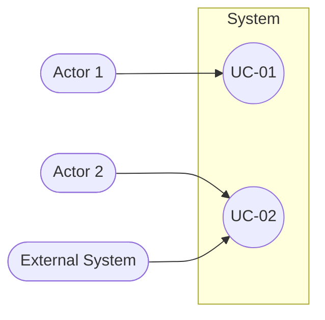

<!--
CHUNK: 03
TITLE: System Users & Use Cases
PROJECT: [Project Name]
VERSION: [X.X]
DEPENDS_ON: 01
PART OF: SDD - [Project Name]
-->

# 7. System Users & Use Cases

## 7.1 Actors

<!-- List all actors (human users and external systems) that interact with the platform. -->

| Actor | Type (Human / System) | Description | Primary Interface |
|-------|-----------------------|-------------|-------------------|
| [Actor 1] | [Human / System] | [Description] | [Interface] |
| [Actor 2] | [Human / System] | [Description] | [Interface] |

## 7.2 Use Case Diagram

**Figure 1: Use Case Diagram**

> Description (tool-agnostic; copy and paste into Miro, Lucidchart, draw.io, or any AI visualizer).

```text
Actors (left side):
  - [Actor 1]
  - [Actor 2]

Actors (right side):
  - [External System 1]
  - [External System 2]

System boundary box: "[System Name]"

Use cases inside the boundary:
  UC-01: [Use Case Name]
  UC-02: [Use Case Name]
  UC-03: [Use Case Name]

Associations:
  [Actor 1] -> [Use Case IDs]
  [Actor 2] -> [Use Case IDs]

Relationships:
  [UC-XX] <<include>> [UC-YY]
  [UC-XX] <<extend>>  [UC-YY]
```

**Mermaid alternative:**



<!-- MASTER: sdd-master.md | PREV: 02-ecosystem-overview.md | NEXT: 04-architecture-style-and-diagrams.md -->
