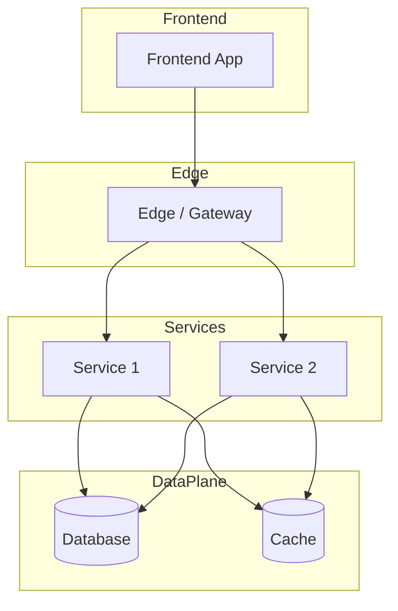

<!--
CHUNK: 04
TITLE: System Design - Architecture Style, Context & HLA Diagrams
PROJECT: [Project Name]
VERSION: [X.X]
DEPENDS_ON: 01, 02
PART OF: SDD - [Project Name]
-->

# 8. System Design / High-Level Architecture

## 8.1 Architecture Style

### 8.1.1 What

<!-- Name the style. -->

[Architecture style statement.]

### 8.1.2 Why

<!-- Why this style fits the business and technical objectives. Tie back to NFRs and BRD objectives. -->

- [Reason 1]
- [Reason 2]
- [Reason 3]

### 8.1.3 How

<!-- How the style manifests in this system: bounded contexts, communication patterns, data ownership, deployment model. -->

- **Bounded contexts:** [List of contexts and which service owns each]
- **Inter-service communication:** [Sync vs async; protocols]
- **Data ownership:** [Ownership rules]
- **Deployment model:** [Packaging and orchestration]

## 8.2 Context Diagram

**Figure 2: System Context Diagram**

> Description (tool-agnostic; copy and paste into Miro, Lucidchart, draw.io).

```text
Center node (system under design):
  "[System Name]"

External actors / systems (around the center):
  - [External entity 1]
  - [External entity 2]
  - [External entity 3]

Connections (label each line with protocol + purpose):
  [Source] --[protocol]--> [Target]   ([purpose])
  [Source] --[protocol]--> [Target]   ([purpose])
```

**Mermaid alternative:**


## 8.3 High-Level Architecture Diagram

**Figure 3: High-Level Architecture**

> Description (tool-agnostic).

```text
Layers, top to bottom:

L1 Edge / Entry:
  - [Components]

L2 Frontend:
  - [Components]

L3 Backend Services:
  - [Service 1]
  - [Service 2]
  - [Service N]

L4 Data Plane:
  - [Datastores]

L5 Async Backbone:
  - [Broker / topics]

L6 External:
  - [External systems]

L7 Observability:
  - [Logs / metrics / traces stack]

Connections:
  - [Connection 1]
  - [Connection 2]
```

**Mermaid alternative:**



<!-- MASTER: sdd-master.md | PREV: 03-users-and-use-cases.md | NEXT: 05-workflows-and-sequences.md -->
