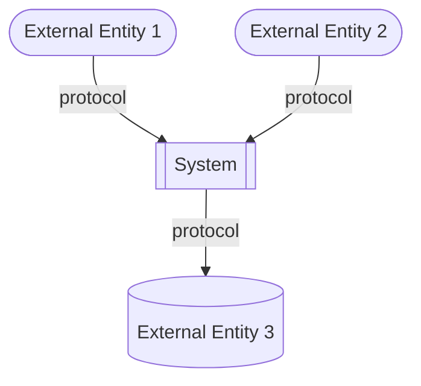
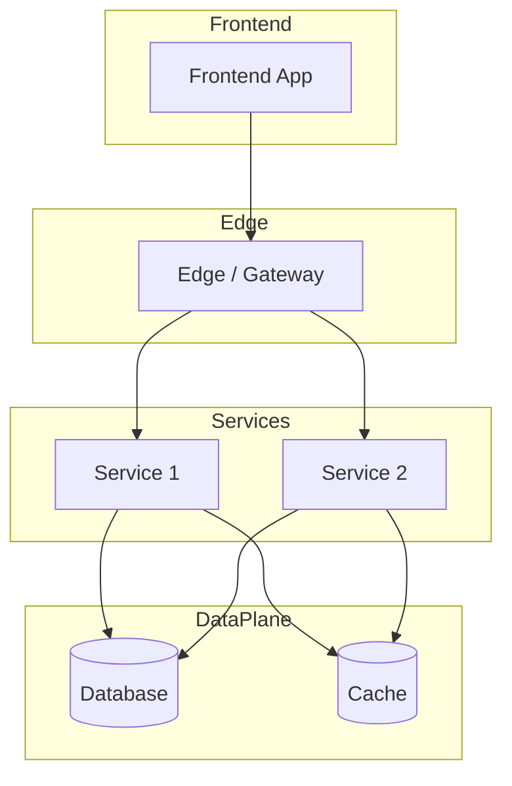

<!--
CHUNK: 04
TITLE: System Design - Architecture Style, Context & HLA Diagrams
PROJECT: [Project Name]
VERSION: [X.X]
DEPENDS_ON: 01, 02
PART OF: SDD - [Project Name]
-->

# 8. System Design / High-Level Architecture

## 8.1 Architecture Style

### 8.1.1 What

<!-- Name the style. Platform default (per the ecosystem doctrine in §6): microservices with an event-driven async backbone (EDA), DDD bounded contexts, hexagonal (ports & adapters) inside each service. Deviations need an ADR. -->

[Architecture style statement.]

### 8.1.2 Why

<!-- Why this style fits the business and technical objectives. Tie back to NFRs and BRD objectives. -->

- [Reason 1]
- [Reason 2]
- [Reason 3]

### 8.1.3 How

<!-- How the style manifests in this system: bounded contexts, communication patterns, data ownership, deployment model. -->

- **Bounded contexts:** [List of contexts and which service owns each]
- **Inter-service communication:** [Sync vs async; protocols]
- **Data ownership:** [Ownership rules]
- **Deployment model:** [Packaging and orchestration]

## 8.2 Context Diagram

**Figure 2: System Context Diagram**

<!-- Inline Mermaid is the default diagram medium. Label each edge with protocol + purpose. Append `> Miro: <url>` only if a richer whiteboard version exists on a real board. -->

**Summary:** [1-2 sentences: who talks to the system and over what.]

## 8.3 High-Level Architecture Diagram

**Figure 3: High-Level Architecture**

<!-- Inline Mermaid is the default diagram medium. Show the layers: edge, frontend, services, data plane, async backbone, external, observability. -->

**Summary:** [1-2 sentences: the layer composition and the load-bearing connections.]

<!-- MASTER: sdd-master.md | PREV: 03-users-and-use-cases.md | NEXT: 05-workflows-and-sequences.md -->
