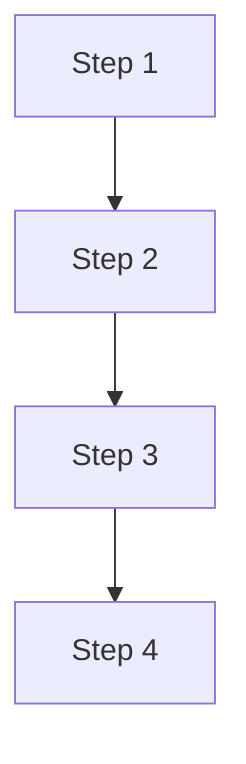
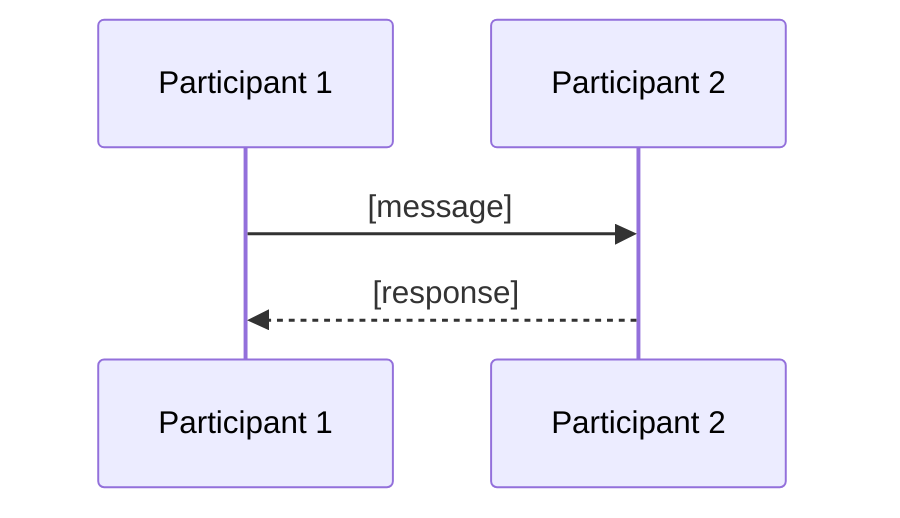

<!--
CHUNK: 05
TITLE: System Design - Workflow & Sequence Diagrams
PROJECT: [Project Name]
VERSION: [X.X]
DEPENDS_ON: 04
PART OF: SDD - [Project Name]
-->

# 8.4 Workflow Diagrams

<!-- This chunk continues the System Design section from chunk 04 (Architecture Style & Diagrams). -->
<!-- Add one workflow per critical end-to-end business flow. Use the same pattern: text description + optional Mermaid. -->

### 8.4.1 Workflow: [Flow Name]

> Description (tool-agnostic).

```text
Steps:
  1. [Step]
  2. [Step]
  3. [Step]
  4. [Step]
  5. [Step]
```

**Mermaid alternative:**



### 8.4.2 Workflow: [Flow Name]

<!-- Repeat for each critical workflow. -->

## 8.5 Sequence Diagrams

<!-- Add one sequence diagram per critical interaction (sync + async). -->

### 8.5.1 Sequence: [Flow Name]

> Description (tool-agnostic).

```text
Participants (left to right):
  [Participant 1], [Participant 2], [Participant 3]

Messages:
  1. [Source] -> [Target]: [message]
  2. [Source] -> [Target]: [message]
  3. [Source] -> [Target]: [message]
```

**Mermaid alternative:**



### 8.5.2 Sequence: [Flow Name]

<!-- Repeat for each critical sequence. -->

<!-- MASTER: sdd-master.md | PREV: 04-architecture-style-and-diagrams.md | NEXT: 06-principles-and-decisions.md -->
