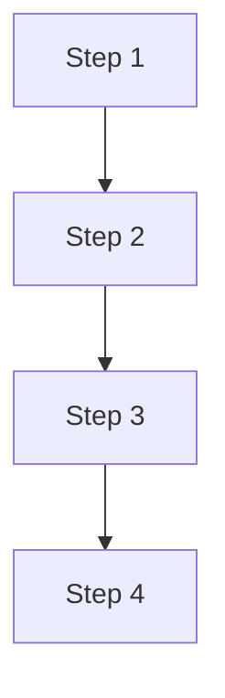
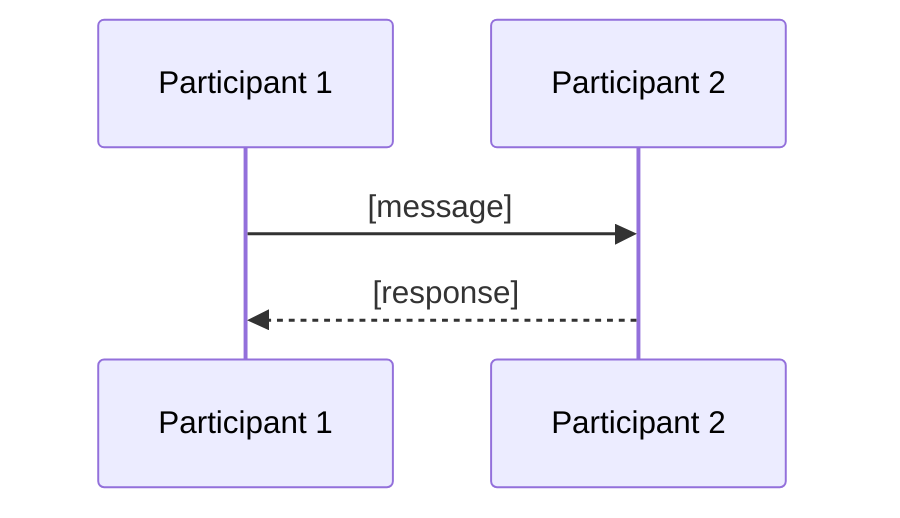

<!--
CHUNK: 05
TITLE: System Design - Workflow & Sequence Diagrams
PROJECT: [Project Name]
VERSION: [X.X]
DEPENDS_ON: 04
PART OF: SDD - [Project Name]
-->

## 8.4 Workflow Diagrams

<!-- This chunk continues the System Design section from chunk 04 (Architecture Style & Diagrams). -->
<!-- Add one workflow per critical end-to-end business flow. Inline Mermaid is the default diagram medium; each diagram gets a 1-2 sentence prose Summary so it reads without rendering. Append `> Miro: <url>` only if a richer whiteboard version exists on a real board. -->

### 8.4.1 Workflow: [Flow Name]

**Summary:** [1-2 sentences describing the flow in prose.]

### 8.4.2 Workflow: [Flow Name]

<!-- Repeat for each critical workflow. -->

## 8.5 Sequence Diagrams

<!-- Add one sequence diagram per critical interaction (sync + async). -->

### 8.5.1 Sequence: [Flow Name]

**Summary:** [1-2 sentences describing the interaction in prose.]

### 8.5.2 Sequence: [Flow Name]

<!-- Repeat for each critical sequence. -->

<!-- MASTER: sdd-master.md | PREV: 04-architecture-style-and-diagrams.md | NEXT: 06-principles-and-decisions.md -->
