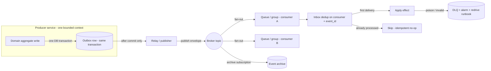
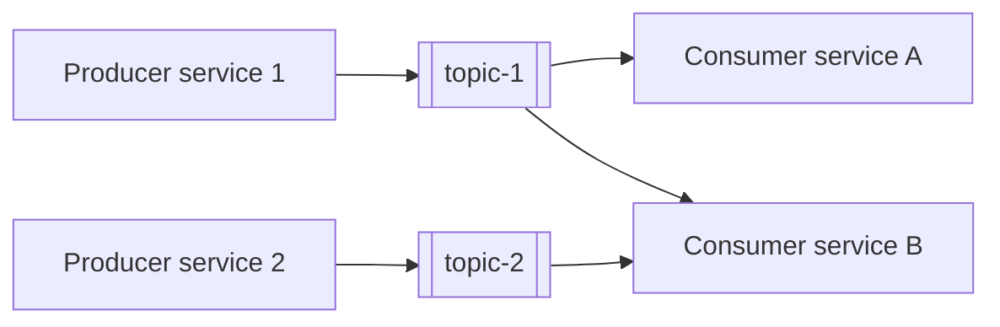

<!--
CHUNK: 10
TITLE: Centralized Event Hub (Platform Event Catalog & Payload Contracts)
PROJECT: [Project Name]
VERSION: [X.X]
DEPENDS_ON: 05, 07, 08, 09
RECONCILES_WITH: every per-service chunk (10a, 10b, ...) - Event Model + Messaging Infra sub-sections
PART OF: SDD - [Project Name]
PURPOSE: Single cross-service catalog of every platform event - name, producer, consumers, envelope, payload contract, business what/when/why - plus the centralized event-hub topology. Consolidates what is otherwise distributed across the per-service Event Models.
CONSISTENCY_RULE: This chunk is the platform contract registry. Topic names, event names, envelope fields, and payload contracts here MUST match the per-service chunks character-for-character. Consumer lists are reconciled from BOTH sides (each producer's published table AND each consumer's consumed table). Where a per-service spec and this catalog disagree, the per-service spec is authoritative for its own published events and the divergence is flagged in the Consistency Notes section - never silently reconciled.
-->

# 14. Centralized Event Hub (Platform Event Catalog & Payload Contracts)

> **What this chunk is.** The one place that lists **every event on the platform** with its producer, consumers, key family, payload contract, and business meaning (what / when / why), plus the hub topology that carries them. It is a derived consolidation of the per-service Event Models (each `10x` chunk § Event-Driven Architecture). Downstream LLD generation and implementers read this chunk as the single contract surface - the key goal is a smooth implementation with no producer/consumer mismatches.

---

## 14.1 Purpose & Scope

<!--
State the platform's eventing posture in one paragraph (EDA default: every cross-service state change travels as an asynchronous event; synchronous REST reserved for true request-response, capped at one hop).
Then answer four questions for the whole platform:
  1. What events exist (count + producing services)
  2. Who produces and who consumes each (reconciled both ways)
  3. What each event carries (envelope + payload contract)
  4. Why and when each fires (business moment + downstream purpose)
State what is OUT of scope: in-process domain events that never leave a service; provider webhooks (REST callbacks, not bus events); external adapter ingestion edges normalized at an anti-corruption layer before any platform event.
-->

[Eventing posture + the four questions + out-of-scope list.]

## 14.2 Hub Topology Decision

<!--
Name the chosen topology and why (e.g., one logical hub realized as one topic per domain plus shared special-purpose topics, fanning out to one queue per consumer; or a single broker cluster with topic-per-aggregate). State what makes it ONE hub (shared envelope standard, shared messaging library, shared schema registry, shared event archive, one delivery semantic).
Include the tradeoff table for the chosen vs rejected topology.
-->

**Decision:** [One-line topology decision.]

What makes it *one hub* is the shared contract surface:

- **One envelope standard** (§14.3) on every event, on every topic.
- **One messaging library / pattern:** [outbox -> relay -> broker -> inbox, per CLAUDE.md outbox mandate].
- **One schema registry:** [registry + additive-only rule, CI-enforced].
- **One event archive:** [archive destination, subscribed from day one, for replay].
- **One delivery semantic:** at-least-once delivery, exactly-once **effect** via `(consumer, event_id)` inbox dedup, per-aggregate ordering via `aggregate_version`.

| Dimension | [Chosen topology] | [Rejected topology] |
|---|---|---|
| Access control | [Note] | [Note] |
| Blast radius | [Note] | [Note] |
| Archive / replay granularity | [Note] | [Note] |
| Ownership | [Note] | [Note] |
| Cost / fan-out | [Note] | [Note] |

### 14.2.1 Async Backbone (the universal per-event mechanism)

### 14.2.2 Hub Topology & Fan-Out Landscape

<!-- Producer -> topic -> consumer shape of the whole platform: structural clusters, not every edge (the full matrix is 14.5). -->

## 14.3 Standard Event Envelope (every event, every topic)

<!-- Every event carries this envelope; only the payload{} body varies per event. Adjust fields to the project but keep the invariants: unique event id (dedup key), typed past-tense fact, schema version, aggregate identity + monotonic version, UTC timestamp, correlation id, tenant keys, payload body. -->

| Field | Type | Meaning |
|---|---|---|
| `event_id` | UUIDv7 | Globally unique; the inbox dedup key `(consumer, event_id)` -> exactly-once effect. |
| `event_type` | string | SCREAMING_SNAKE_CASE, past-tense fact (e.g., `PAYMENT_COMPLETED`). |
| `schema_version` | semver | Schema version from the registry (additive-only). |
| `aggregate_id` | UUIDv7 | The producing aggregate instance. |
| `aggregate_type` | string | The producing aggregate (e.g., `Invoice`). |
| `aggregate_version` | int | Per-aggregate monotonic counter; the ordering / last-writer-wins guard. |
| `occurred_at` | timestamp (UTC) | When the fact happened. |
| `correlation_id` | UUIDv7 | Opaque request/trace correlation; carries no tenant data or PII. |
| `causation_id` | UUIDv7 (optional) | The event that caused this one. |
| `tenant_id` | UUIDv7 | Tenant key. [Adjust to the project's tenancy keys.] |
| `payload{}` | JSON | Event-specific body; schema owned by the registry (§14.9). |

**Key-family variants (if applicable):**

- [Family 1, e.g., tenant-keyed - most domain events.]
- [Family 2, e.g., generic keys for reusable services, mapped at an anti-corruption layer.]
- [Exceptions, each named and justified.]

## 14.4 Topic Registry

<!-- One row per topic. Every topic has exactly ONE owner (sole publisher). Names here are canonical - per-service chunks must use them verbatim. -->

| # | Topic | Owner (sole publisher) | Key family | Phase |
|---|---|---|---|---|
| 1 | `[project]-[domain]-events` | [Service] | [Key family] | [P1] |
| 2 | `[project]-[domain]-events` | [Service] | [Key family] | [P1] |

**No topic, no published events (consumers only):** [List consumer-only services, e.g., API Gateway, Analytics.]

## 14.5 Platform Event Catalog

<!--
Grouped by producing service / topic - one sub-section per producer, in §13 decomposition order.
Status legend: committed = wired in its phase; candidate = name fixed, no consumer wired until the contract ratifies; Analytics-only = no named domain consumer.
Consumer reconciliation: consumer lists are reconciled from BOTH the producer's published table AND every consumer's consumed table. Where a producer under-lists, show the broader real set and footnote it.
-->

**Status legend:** `committed` / `candidate` / `Analytics-only` / `Pn` = phase.

### 14.5.1 [Producer Service] — `[topic-name]` ([key family]; [phase])

| Event | Consumers | Payload (beyond envelope) | Business: what · when · why | Status |
|---|---|---|---|---|
| `[EVENT_NAME]` | [Consumer services] | `[fields beyond the envelope]` | [What fact] · [when it fires] · [why downstream cares] | [committed] |
| `[EVENT_NAME]` | [Consumer services] | `[fields]` | [what · when · why] | [candidate] |

### 14.5.2 [Producer Service] — `[topic-name]` ([key family]; [phase])

| Event | Consumers | Payload (beyond envelope) | Business: what · when · why | Status |
|---|---|---|---|---|
| `[EVENT_NAME]` | [Consumer services] | `[fields]` | [what · when · why] | [Status] |

<!-- Repeat 14.5.X per producing service. -->

## 14.6 Cross-Cutting Event Guarantees

<!-- The invariants every edge inherits. Keep as a numbered list, e.g.: -->

1. **Atomicity:** domain state + outbox row commit in one transaction; the relay publishes only after commit (no dual-writes).
2. **Delivery:** at-least-once everywhere; consumers dedup on `(consumer, event_id)`.
3. **Ordering:** per-aggregate via `aggregate_version` (last-writer-wins for projections; validated transitions for state machines) — not broker ordering.
4. **Poison handling:** invalid transitions and undeserializable messages dead-letter with alarm + redrive runbook; never silently dropped.
5. **Schema evolution:** additive-only, registry-enforced; breaking change = new event name.
6. **Replay:** archive -> consumer queue, never archive -> topic.
7. [Project-specific guarantee.]

## 14.7 Universal Subscribers & Cross-Service Doctrines

<!--
Name the broad consumers (e.g., Analytics binds every domain topic; Notification binds the wired delivery set) and any platform doctrines, e.g.:
- Re-publication doctrine: a reusable service's generic fact is consumed ONLY by the initiating service, which re-publishes its own domain fact.
- Shared special-purpose topics and their sole consumers.
-->

- [Universal subscriber 1 + breadth rule.]
- [Universal subscriber 2 + breadth rule.]
- [Doctrine 1, e.g., money-fact re-publication: initiator-only consumption + domain re-publication.]

## 14.8 Consistency Notes & Open Flags

<!--
The reconciliation ledger for producer/consumer consistency. Every divergence found while consolidating the per-service Event Models lands here with a pointer - never silently reconciled. Empty section = full reconciliation achieved; state that explicitly.
-->

| # | Where (chunks) | Divergence | Resolution / flag |
|---|---|---|---|
| 1 | [10x vs this chunk] | [e.g., consumer under-listed / payload field mismatch / topic name drift] | [Fixed in 10x on YYYY-MM-DD / flagged as OI-NN] |

## 14.9 Payload Contract Samples

<!--
Per-event payload contracts in the style of a schema-registry draft. Rules:
  - The envelope (§14.3) is NOT repeated per event - only payload{} fields beyond the envelope.
  - Type vocabulary: uuid, string, int, decimal(p,s), bool, timestamp (UTC ISO-8601), enum{...}, ref(ValueObject), array<T>, map<K,V>.
  - Required column: R = required, O = optional, C = conditional (state the condition in Notes).
  - Status mirrors §14.5.
  - PII fields are tagged `pii` and must appear in the erasure-path mapping.
Define common value objects once, then reference them.
-->

### 14.9.0 Common Value Objects

| Value object | Fields | Used by |
|---|---|---|
| `Money` | `amount decimal(19,4)`, `currency string(ISO-4217)` | [events] |
| `[ValueObject]` | [fields] | [events] |

### 14.9.1 `[EVENT_NAME]` — [status]

**Producer:** [service] · **Topic:** `[topic-name]` · **Key family:** [family]

| Field | Type | Required | Notes |
|---|---|---|---|
| `[field]` | [type] | R | [meaning; `pii` tag if applicable] |
| `[field]` | [type] | O | [meaning] |

<!-- Repeat 14.9.X per event. For large platforms, sample the load-bearing events here and keep the full set in the schema registry; state explicitly which events are registry-only (no silent gaps). -->

### 14.9.99 Coverage Matrix

<!-- One row per event in §14.5: does it have a payload contract here or in the registry? This is the single source of the platform event count. -->

| Event | Catalog (§14.5) | Contract (§14.9 / registry) | Status |
|---|---|---|---|
| `[EVENT_NAME]` | ✓ | [§14.9.1 / registry-only] | [committed] |

<!-- MASTER: sdd-master.md | PREV: 09-services-summary.md | NEXT: 10a-service-detailed-template.md -->
