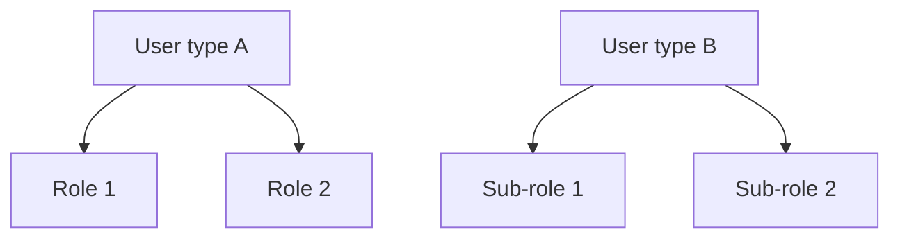
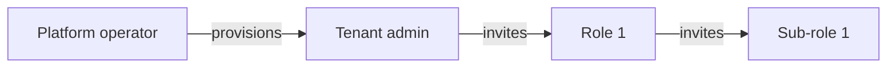
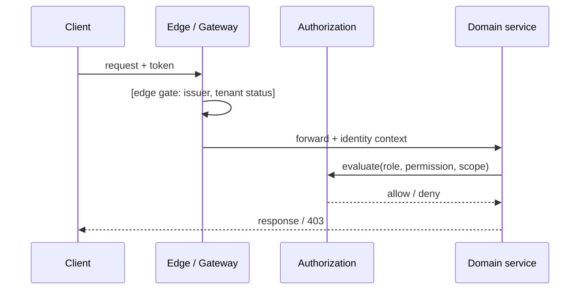

<!--
CHUNK: 11
TITLE: Centralized User Roles & Authorities (Platform-Wide)
PROJECT: [Project Name]
VERSION: [X.X]
DEPENDS_ON: 03, 07, 09 (+ per-service chunks 10a, 10b, ... for per-service authorization notes)
PART OF: SDD - [Project Name]
PURPOSE: Single platform-wide reference for user types, roles, sub-roles, and their authorities - who can do what, who can create whom, which services each role touches, and how a role resolves to an allowed action at request time. Consolidates the BRD's Users & Use Cases Matrix and the per-service authorization notes into one canonical catalogue. Companion reference to the Centralized Event Hub (chunk 10).
CONSISTENCY_RULE: Role names, permission tokens, and per-service authorization notes in the 10x chunks MUST match this catalogue verbatim. Divergences are flagged here (see the drift register), never silently reconciled.
-->

# 16. Centralized User Roles & Authorities (Platform-Wide)

> **What this chunk is.** The one place that answers: what user types exist, which roles and sub-roles they break into, what each role is allowed to do, who may create or invite whom, and which services each role interacts with. Downstream, the LLD and the identity/authorization implementation seed from this catalogue - the key goal is that authorization behaves identically across every service.

---

## 16.1 Business Overview

<!-- 1-2 paragraphs in plain language: the tiers of users on the platform, the tenancy planes they live in (e.g., platform operator vs tenant company vs end customer), and the business rationale for the split. -->

[Business overview.]

## 16.2 Resolution Model — How a Role Becomes an Allowed Action

<!-- Describe the runtime path from identity to permitted action: token claims -> role/sub-role resolution -> permission lookup -> contextual gates (tenant scope, ownership, module enablement, subscription status). Name where each gate is enforced (edge gateway, authorization service, service-local check). -->

[Resolution model: identity -> role -> permission -> contextual gates, with enforcement points.]

## 16.3 User Types (Tier 1)

| User type | Tenancy plane | Identity source | Description |
|---|---|---|---|
| `[USER_TYPE]` | [Platform / Tenant / End-customer] | [IAM realm / pool] | [Description] |
| `[USER_TYPE]` | [Plane] | [Source] | [Description] |

## 16.4 Role Catalogue — Authorities & Related Services

<!-- One sub-section per Tier-1 user type. Each table: role, scope, core authorities (verbs), related services. -->

### 16.4.1 [User type A] Roles

| Role | Scope | Core authorities | Related services |
|---|---|---|---|
| `[ROLE]` | [company / compound / unit / global] | [What it may do, verb-level] | [Services touched] |

### 16.4.2 [User type B] Sub-Roles

| Sub-role | Scope | Core authorities | Related services |
|---|---|---|---|
| `[SUB_ROLE]` | [Scope] | [Authorities] | [Services] |

### 16.4.3 Platform Plane (operator — outside tenant tenancy)

| Role | Scope | Core authorities | Related services |
|---|---|---|---|
| `[PLATFORM_ROLE]` | global | [Break-glass, provisioning, billing ops, support] | [Services] |

## 16.5 Capability Matrix (canonical)

<!-- The compact capability view: capabilities as rows, roles/sub-roles as columns, Yes / - / footnoted-conditional cells. Conditional footnotes become explicit attribute-based rules (own records only, own unit only, etc.). -->

| Capability | `[ROLE_1]` | `[ROLE_2]` | `[SUB_ROLE_1]` |
|---|---|---|---|
| [Capability] | Yes | - | Yes¹ |

¹ [Condition, e.g., own unit only.]

## 16.6 Grant / Invitation Authority (who can create whom)

| Grantor role | May create / invite | Constraints |
|---|---|---|
| `[ROLE]` | `[ROLE(S)]` | [Scope limits, approval gates, count limits] |

## 16.7 Role → Related-Services Matrix (platform-wide)

<!-- Roles as rows, services as columns; cell = the interaction class (admin / write / read / none). Service names must match §13 decomposition verbatim. -->

| Role | [Service 1] | [Service 2] | [Service 3] |
|---|---|---|---|
| `[ROLE]` | [admin / write / read / -] | [—] | [—] |

## 16.8 Lifecycle, Scope & Revocation Rules

<!-- Numbered rules: how roles are granted at onboarding, how they change, what suspends or revokes them, what happens to in-flight work on revocation, and the erasure path. -->

1. [Grant rule.]
2. [Change rule.]
3. [Suspension / revocation rule + effect on in-flight work.]
4. [Erasure rule.]

## 16.9 Diagrams

### 16.9.1 Role Taxonomy (user types → roles → sub-roles)

### 16.9.2 Grant / Invitation Authority (who may create whom)

### 16.9.3 Per-Request Authorization (how a role yields a decision)

## 16.10 Traceability

<!-- Map back to the sources: BRD Users & Use Cases Matrix rows, per-service authorization notes (10x chunks), and ADRs that shaped the model. Every capability row must trace to at least one BRD UC or an ADR. -->

| Capability / rule | Source (BRD UC / matrix row / ADR / 10x chunk) |
|---|---|
| [Capability] | [Source ref] |

## 16.11 Permission × Role Matrix (platform-wide)

<!-- The exhaustive grid: one row per permission token (the runtime names services check), one column per role/sub-role. This is the implementation-facing view; §16.5 is the business-facing view. Keep tokens in the exact runtime spelling. -->

| Permission token | `[ROLE_1]` | `[ROLE_2]` | `[SUB_ROLE_1]` |
|---|---|---|---|
| `[service].[resource].[action]` | ✓ | - | ✓¹ |

## 16.12 Implementation Seed & Reconciliation

<!-- How this catalogue becomes data: the seed rows for the role/permission store, per-role action counts as a drift baseline, the canonical name-map from grid labels to runtime tokens, and a drift register for divergences found between this chunk, the BRD matrix, and per-service chunks. -->

### 16.12.1 Seed Strategy

[Where the seed lives (migration / fixture), and the update rule when roles change.]

### 16.12.2 Per-Role Action Counts (drift baseline)

| Role | Seeded permission count |
|---|---|
| `[ROLE]` | [N] |

### 16.12.3 Drift & Reconciliation Register

| # | Where | Divergence | Resolution / flag |
|---|---|---|---|
| 1 | [BRD matrix vs 10x vs this chunk] | [Mismatch] | [Fixed on YYYY-MM-DD / flagged as OI-NN] |

<!-- MASTER: sdd-master.md | PREV: 10a-service-detailed-template.md | NEXT: 12-performance-and-capacity.md -->
