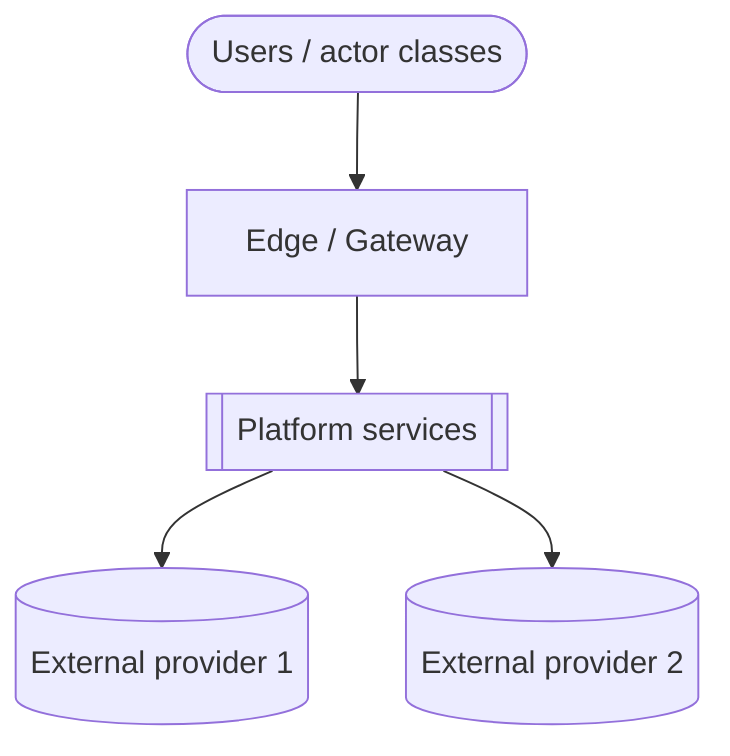
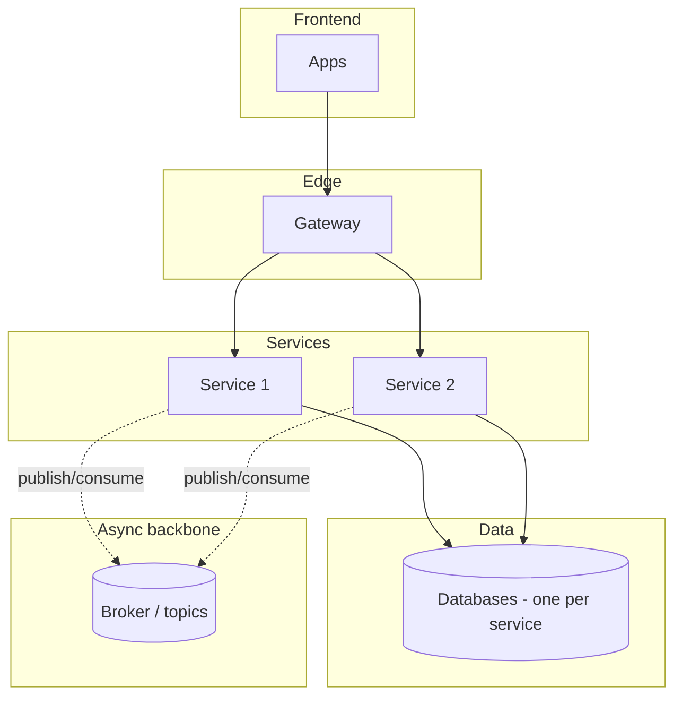
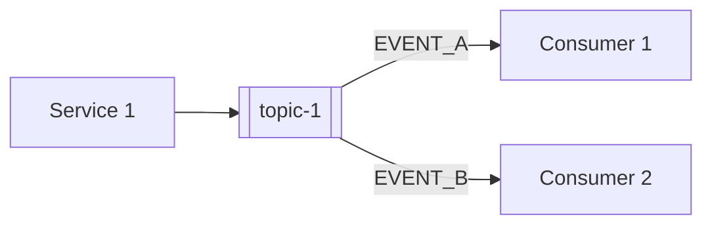
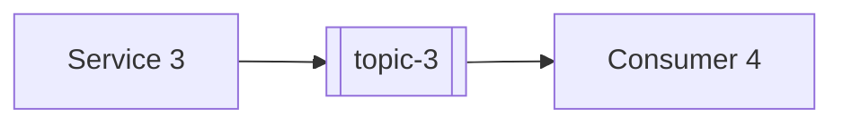
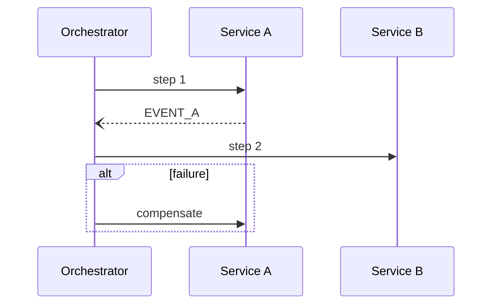

<!--
CHUNK: 16
TITLE: End-to-End System Design (Services · Topics · Producers · Consumers)
PROJECT: [Project Name]
VERSION: [X.X]
DEPENDS_ON: 04, 05, 09, 10 (event hub), 10a+ (per-service chunks), 11 (user roles)
PART OF: SDD - [Project Name]
PURPOSE: The single end-to-end view of the whole system: every service, every topic, every producer->consumer edge, the synchronous REST edges, and the key sagas. Authored LAST among body chunks so it consolidates the final reconciled state.
FAITHFULNESS_RULE: This chunk is a faithful consolidation, not a new design. Every count, name, and edge must trace to chunks 09, 10, and 10x. Any deliberate simplification (clustered edges, sampled sagas) is stated explicitly - no silent caps.
NO_DUPLICATION_RULE: One fact, one home. This chunk shows only what no other chunk shows (the whole-system fan-out maps and saga views). Normative content owned elsewhere (the async mechanism §14.2.1, the topic registry §14.4, the guarantees §14.6, the doctrines §14.7) is REFERENCED, never restated.
-->

# 22. End-to-End System Design (Services · Topics · Producers · Consumers)

> **What this chunk is.** The bird's-eye, implementation-facing map of the entire platform: the service landscape, the system context, the layered architecture, the full producer → topic → consumer fan-out, the synchronous edges, and the key sagas. A new engineer (or AI implementer) reads this chunk to understand how the system fits together, following its references into chunks 10/11/10x for the normative contracts.

---

## How to Read This Document

<!-- One short paragraph: reading order of the sections, and what each diagram notation means. -->

[Reading guidance.]

### Counts at a Glance

| Dimension | Count | Source of truth |
|---|---|---|
| Services | [N] | §13 (chunk 09) |
| Topics | [N] | §14.4 (chunk 10) |
| Distinct published events | [N] | §14.9 coverage matrix (chunk 10) |
| Synchronous REST edges | [N] | §22.7 |
| Sagas documented | [N] | §22.8 |

### Faithfulness & Deliberate Simplifications (no silent caps)

<!-- List every simplification made in this chunk's diagrams (e.g., "domain producers clustered into one node in §22.2", "only the 3 load-bearing sagas drawn"). If nothing was simplified, say so. -->

- [Simplification 1 + where the full detail lives.]

## 22.1 Service Landscape (archetype × phase)

<!-- One row per service: archetype (domain / reusable-generic / edge / read-model / orchestrator), phase, key family, sync surface, async surface. Names verbatim from §13. -->

| # | Service | Archetype | Phase | Publishes to | Consumes from | Sync surface |
|---|---|---|---|---|---|---|
| 1 | [service] | [archetype] | [P1] | `[topic]` | `[topics]` | [REST APIs exposed] |

## 22.2 System Context

## 22.3 Layered High-Level Architecture

## 22.4 The Universal Per-Event Mechanism (async backbone)

<!-- Owned by §14.2.1 (chunk 10) - referenced, never restated here. One prose sentence + the pointer. -->

Every event on every topic flows through the one universal mechanism — outbox → relay → topic → per-consumer queue with inbox dedup and DLQ. **Normative definition and diagram: §14.2.1 ([10-events-hub.md](./10-events-hub.md)).**

## 22.5 Producer → Topic → Consumer Fan-Out (the event map)

<!-- One sub-section per delivery phase. Each: a Mermaid flowchart of producer -> topic -> consumers for that phase's services. Edge labels name the load-bearing events. The exhaustive matrix stays in §14.5; this is the navigable visual. -->

### 22.5.1 Phase 1 Core

### 22.5.2 Phase 2+ Domains

### 22.5.3 Universal Subscribers (breadth rules)

<!-- Name the broad consumers only (they would clutter every fan-out diagram above); their binding rules are owned by §14.7 - reference, don't restate. -->

- [Universal subscriber — see §14.7 for its binding rule.]

## 22.6 Cross-Service Doctrines

<!-- Name each platform-wide interaction doctrine + a pointer to its normative home (§14.7 / ADR). Names only - the rules are not restated here. -->

1. [Doctrine name — normative home §14.7 / AD-NN.]

## 22.7 Synchronous REST Edges (one-hop rule)

<!-- Every service-to-service synchronous call on the platform. Per CLAUDE.md: no chained REST more than one hop deep. Each row: caller -> callee, purpose, why it must be synchronous. -->

| # | Caller → Callee | Purpose | Why synchronous |
|---|---|---|---|
| 1 | [svc] → [svc] | [Purpose] | [Justification] |

## 22.8 Key Sagas (dynamic view)

<!-- One sub-section per load-bearing cross-service flow: orchestrator (or choreography), participants, happy path, compensation path. Mermaid sequence diagrams. -->

### 22.8.1 [Saga name] ([orchestrated by X / choreographed])

## 22.9 Normative References

<!-- Pure pointer section - no tables, no restated rules. One fact, one home. -->

- **Topic registry (one row per topic, owner, key family):** §14.4 ([10-events-hub.md](./10-events-hub.md)).
- **Per-event consumer reconciliation:** §14.5; payload contracts: §14.9.
- **Cross-cutting guarantees every edge inherits:** §14.6.
- **Universal subscribers & doctrines:** §14.7.
- **Roles & authorities behind every edge's authorization:** §16 ([11-centralized-user-roles.md](./11-centralized-user-roles.md)).

## Sources

<!-- The chunks this consolidation was built from, with a one-line note per source. -->

- Chunk 09 (§13 decomposition) · chunk 10 (§14 event hub) · chunks 10a+ (§15 service specs) · chunk 11 (§16 roles).

<!-- MASTER: sdd-master.md | PREV: 15-appendix-and-wishlist.md | NEXT: 17-open-items-and-clarifications.md -->
