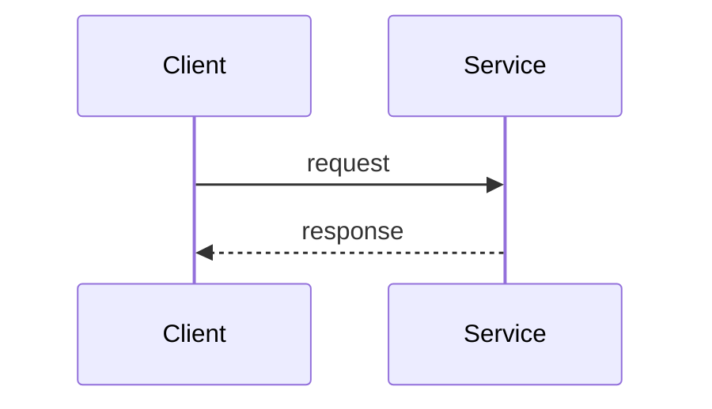

# Mermaid Diagrams (default) — with Miro on demand

All SDD diagrams are authored as **inline Mermaid** by default. Every diagram is followed by a 1-2 sentence prose **Summary** so a reader without a Mermaid renderer still understands what it says. Miro boards are produced **only when the user explicitly asks** — see § Miro on demand.

## Why Mermaid-first

1. The SDD lives in git next to the BRD and LLD; inline diagrams version, diff, and review with the text.
2. AI implementers and the LLD generation read the SDD directly — an inline diagram is machine-readable; a board link is not.
3. No external dependency: the document is complete offline, with no MCP or board access required.

---

## Diagram-type → dialect map

| Template section | Diagram | Mermaid dialect |
|---|---|---|
| §7.2 Use Case Diagram | Actors → use-case clusters (carry UC IDs from the BRD) | `flowchart LR` |
| §8.2 Context Diagram | System in the middle, externals around it, edges labelled protocol + purpose | `flowchart TB` |
| §8.3 High-Level Architecture | Layers (edge, frontend, services, data, async backbone, external, observability) | `flowchart TB` with `subgraph` |
| §8.4 Workflow Diagrams | One per critical end-to-end flow | `flowchart TD` |
| §8.5 Sequence Diagrams | One per critical interaction (sync + async) | `sequenceDiagram` |
| §12 Integrations | Integration topology, edges labelled with protocol/mechanism | `flowchart LR` |
| §14.2 Event hub (chunk 10) | Async backbone mechanism + hub fan-out landscape | `flowchart LR` |
| §15.X DB Modeling | ERD per service | `erDiagram` |
| §15.X Business Logic state machine | State diagram for genuinely stateful services | `stateDiagram-v2` |
| §15.X Service-Level Diagrams | Per-service flow / internal sequence | `flowchart TD` / `sequenceDiagram` |
| §16.9 User roles (chunk 11) | Role taxonomy, grant authority, per-request authorization | `flowchart TD` / `flowchart LR` / `sequenceDiagram` |
| §22 E2E system design (chunk 16) | Context, layered architecture, fan-out maps, sagas | `flowchart` / `sequenceDiagram` |

**Do not** draw a diagram for:
- Glossary, Assumptions, Risks, Ecosystem Overview, Principles/ADRs, Environments — tabular/list content.
- Services whose logic fits in 3–6 bullets with no state machine.
- Stateless services (no state machine) and one-step workflows.

Fewer, more meaningful diagrams beat decorative ones.

---

## Block conventions

````markdown


**Summary:** [1-2 sentences of prose describing what the diagram shows.]
````

**Rules:**

- Always use the `mermaid` language hint on the fence.
- The **Summary** line after every diagram is mandatory — it is the no-renderer fallback.
- Use named participants / meaningful node ids; annotate alt-paths for error scenarios.
- Keep diagrams scoped — split anything beyond ~30 lines into happy-path + error-path diagrams.
- Figure numbering is sequential across the whole SDD (not per chunk); every figure gets a row in chunk 00's Figures index with its chunk + section.

## Render-fail mitigation

1. Validate every emitted Mermaid block parses (syntactically) before writing.
2. If a block fails to validate, fall back to a plain-text description in a `text` code-fence + `[NEEDS CLARIFICATION: Mermaid syntax error — review and fix]`.
3. Surface the fallback count in the handoff summary.

## Syntax quick reference

See `../lld-unifier/mermaid-diagrams.md` § Mermaid syntax quick reference for the dialect cheatsheet (`sequenceDiagram`, `classDiagram`, `stateDiagram-v2`, `erDiagram`, `flowchart`) — the conventions are shared across the unifier skills.

---

## Miro on demand (only when the user explicitly asks)

If — and only if — the user asks for a Miro board ("put the diagrams on Miro", "create a board"):

1. Load Miro tools via ToolSearch (they are deferred).
2. Create or reuse a board named `SDD — [Project Name] — Diagrams` (`Miro:context_explore` to check; ask for the URL when updating an existing SDD — don't guess).
3. Author the requested figures with `Miro:diagram_get_dsl` → `Miro:diagram_create`; frame names mirror the SDD figure titles (`Figure 1 — System Context`, …).
4. Append the link BELOW the corresponding inline Mermaid block — additive, never a replacement:

   ```markdown
   > Miro: https://miro.com/app/board/<board-id>/?moveToWidget=<widget-id>
   ```

5. Record the board URL in chunk 00's Figures index and in the handoff summary.

**Never** write a Miro placeholder (`> Miro: [TBD]`) when no real board exists, and never drop the inline Mermaid in favour of a board link — the Mermaid stays authoritative.

If the Miro MCP is unavailable when the user asked for a board: generate the SDD normally (Mermaid is unaffected), tell the user the Miro MCP wasn't available, and list the figures that would be mirrored to the board once it is.
